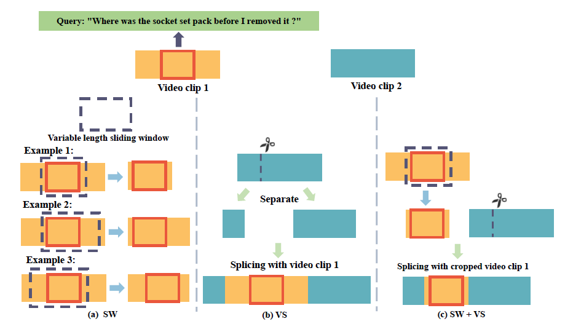

| 序号 | 论文标题                                                     | 更新时间   |
| ---- | ------------------------------------------------------------ | ---------- |
| 1    | 2022-arXiv-ReLER@ZJU-Alibaba Submission to the Ego4D Natural Language Queries Challenge 2022 | 2022.10.17 |
|      |                                                              |            |
|      |                                                              |            |

template：

**20xx-where-title**

核心思想：

xxxx

代码：xxxx

相关细节：

顺便吐个槽：

启发：

1. **2022-arXiv-ReLER@ZJU-Alibaba Submission to the Ego4D Natural Language Queries Challenge 2022**

	核心思想：

	浙江大学庄越挺组在Ego4d文本查询帧挑战中得到的第一名方案。该课题给出一个视频clip和一段查询文本，要求定位到视频clip中的一个包含查询问题答案的时序片段（span）。作者提出了一个多尺度的跨模态transformer、一个帧级别的对比学习损失、两种数据增强的方式（变长滑窗采样、视频剪切）。其实还是一个很经典的思路，即transformer+对比学习+扩充训练数据。论文其实还没写完，目前写了4页，估计后续是打算写完投稿CVPR。

	代码：[Ego4d_NLQ_2022_1st_Place_Solution](https://github.com/NNNNAI/Ego4d_NLQ_2022_1st_Place_Solution)

	相关细节：

	1. 作者提出，本课题主要面临两类挑战：一是定位要求很精确，Ego4D的视频clip平均时长达到7.5分钟，然而最终输出结果标注的平均时长仅为5秒；二是数据量比较缺乏，虽然Ego4D数据集里有10000个clip-text对，但是其中只有1200个视频片段，不足以支撑训练。
	
	 2. 作者使用了一个T层（默认是3层）的cross attention模块作为自己的backbone（PS：这么说其实也不准确，其实模型是利用了Ego4D官方提供的slow-fast和Omnivore提供的视频特征，文本特征则是用CLIP提取的，所以这里的backbone并不承担最低级的特征提取工作），并基于backbone设计了一个显著度判别器、关键区域判别器、有条件跨度判别器。为了增强特征，作者还利用CLIP来强化特征学习，作者对于视频特征的每一帧，随机选择其一个原始输入帧并输入进CLIP的image encoder（基于Vit-B/16）得到特征，这个视觉特征和视频特征拼接在一起，作为最终的输入特征。而文本特征则通过CLIP的文本编码器得到，不过作者不是CLIP传统的利用\<EOS\>的特征，而是翻转句子得到token级别的信息（？？？这是个甚么意思？等回头看代码再说吧）。
	
	  3. 作者的多尺度技术来源于另一篇论文VSLNet-L，该方案将视频分为$K$个视频片段，每个视频片段$V_k$各自输入跨模态编码器得到特征$F_k$，随后由Nil Prediction Module处理（该模块出自论文Natural language video localization: A revisit in span-based question answering framework）得到分数，该分数的含义是视频片段$V_k$和查询文本对应段的重合置信度。所有特征经过该分数的重新加权后在sequence维度上拼接起来并输入预测头。为了预测目标段，作者利用了VSLNet的条件跨度判别器和Moment DETR的显著度判别器。其中条件跨度判别器使用两层transformer encoder和两层线性层来预测输出span的开始和结束；而关键区域判别器和显著度判别器都是用两个线性层构成的，用于预测哪个视频帧属于输出span。
	
	  4. 损失函数的设计：一个直观的理念是，有关本文的NLQ任务，同一个视频里和文本对应的部分和文本的相似度应该高于其他部分。作者设计的计算视频帧和输入文本的函数为帧的特征$1\times d_v$和文本里每个词的特征$1\times d_t$点乘后求平均，再除以温度常量（默认为0.07）。基于上述两点，作者的对比学习函数则是很常规的NCE损失，限制同一个视频中和文本对应的片段为正样本，其他片段为负样本。除了NCE损失外，作者还使用了span损失、QGH损失、NPM损失、saliency损失，这些损失的设计可以参考Span-based localizing network for natural language video localization; A revisit in span-based question answering framework; Qvhighlights: Detecting moments and highlights in videos via natural language queries。
	
	  5. 数据增强：作者的数据增强方式是变长滑窗采样、视频剪切的结合，下图展示了其区别。前者首先确定一个采样范围$[r_s, r_e],r_s,r_e\in [0,1]$，在范围内随机采样一个数$\hat{r}$，滑窗的大小则为$\hat{r}*l_v$，其中$l_v$是视频的整体长度，利用此方法从视频中采样正样本clip，并确保其包含标注所对应的span。而后者则取另一段视频A并将其剪裁成两段，放至视频B的开头结尾，构成一个新的视频clip，特别地，有一个超参数$P_{vs}$控制同时slice两段视频的概率（这个我其实不是很懂，是二者都裁剪然后穿插拼接吗？作者在论文中阐述得比较模糊）。作者的结合方式如下：首先取视频$V_1,V_2$，然后利用随机滑窗采样得到正样本clip：$V_{1p}$，然后将slicing策略应用在$V_{1p}$和$V_2$上，获得最终的clip。
	
	  6. 作者的方法利用了两种预提取的特征：slowfast和omnivore，效果相差几乎为0。但是二者ensemble起来效果还是有明显提升的。关于ensemble策略就不展开介绍了，因为明显是一个trick。
	
	     
	
	顺便吐个槽：
	
	1. 作者的模型其实提升已经很大了，但是性能也还是很低。IoU=0.3的R@1仅10.79%，IoU=0.5的R@1仅6.74%，大胆预测，不训练编码器还是一个非常影响模型性能的操作，后续会继续观望。

