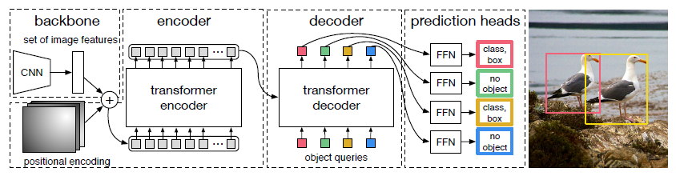

| 序号 | 论文标题                                                | 更新时间   |
| ---- | ------------------------------------------------------- | ---------- |
| 1    | 2020-ECCV-End-to-End Object Detection with Transformers | 2022.10.31 |
|      |                                                         |            |
|      |                                                         |            |

template：

**20xx-where-title**

核心思想：

xxxx

代码：xxxx

相关细节：

顺便吐个槽：

启发：

1. **2020-ECCV-End-to-End Object Detection with Transformers**

   核心思想：

   将Tranformer用于目标检测中，完成了一个单流的目标检测框架。作者还在segmentation上做了扩展实验，效果同样显著。据作者本人所说，本文和前人工作一个很重要的区别是前人工作普遍是自回归模型，而本文工作则是平行decoder架构。模型包含一个cnn backbone、encoder-decoder transformer和一个预测目标的FFN模块。

   代码：[facebookresearch/detr](https://github.com/facebookresearch/detr)

   相关细节：

   1. 实验证明，DETR在大物体上的效果明显好于Faster-RCNN，但是在小物体上则相对较弱。
   2. 损失函数的设计遵循了传统的匈牙利算法的思路，采用二分图匹配来进行预测bbox和ground truth间的匹配
   3. CNN输出为降采样32倍（宽高各32倍），通道数2048的特征。
   4. Transformer的encoder部分没什么好讲的，唯一比较特别的地方是输入前加了一个$1\times 1$卷积进行降采样。但是decoder部分相对于原文做了很多调整，首先，DETR的decoder是并行解码的，其次，positional embeddings在此处得到了具体的解释，即为object queries（decoder的positional embeddings和encoder的是不一样的），最终输出bbox时，每个patch的特征（CNN得到的最终feature map上每一块即为一个patch），换而言之，最终输出的bbox数严格等于feature map里的特征数。
   5. FFN层主要输出每个特征预测得到的bbox坐标和预测出的类别，其中特别地有一个空集类，表示bbox中的物体不属于任何类别（因为预测等同于feature map特征数的目标难免会存在冗余）。
   6. 从含义上来讲，DETR相较于Faster-RCNN利用transformer建模了目标之间的关系，得到了图像的上下文信息。
   7. 经过作者的实验，在decoder的每一层都加上FFN（共享参数）和匈牙利损失后，对模型的性能，尤其是正确预测每个类别目标数的性能有很大的帮助。
   8. 作者做了一个消融实验，证明了删除transformer中的FFN后模型性能有大幅下降（PS：其实模型性能本身也没有比Faster-RCNN高出非常多，这也侧面说明光靠attention其实模型性能并不是很优越，这点与前人做过的transformer中FFN的重要性远大于attention不谋而合）
   9. 作者还做了一个很有意思的可视化实验，可视化每个patch feature最终预测的bbox中心点的位置，从结果上来看，大部分的patch都有预测图像中大物体的中心点的功能，这可能和COCO的数据分布（大物体往往在整张图像占比比较大且位于中心）有关。为了验证这一点，作者手工制作了一张包含24只长颈鹿且分布极其均匀的图像，DETR仍然可以正确预测到每只长颈鹿的位置，这验证了模型对于不同分布也具有鲁棒性（这个实验设计的理念很精妙）。

   顺便吐个槽：

   启发：

​	