| **目录** |                                                              |                              |
| :------- | :----------------------------------------------------------- | ---------------------------- |
| 0        | CUHK-PEDES数据集总结                                         |                              |
| 1        | 2020-TIP-Improving Description-based Person Re-identification by Multi-granularity Image-text Alignments | 王海光                       |
| 2        | 2020-ECCV-ViTAA: Visual-Textual Attributes Alignment in Person Search by Natural Language | 王海光，王靖尧，白杨         |
| 3        | 2019-ICCV-Person Search by Text Attribute Query as Zero-Shot Learning | 王海光，白杨                 |
| 4        | 2020-WACV-Text-based Person Search via Attribute-aided Matching | 王海光                       |
| 5        | 2020-TIP-MAVA: Multi-Level Adaptive Visual-Textual Alignment by Cross-Media Bi-Attention Mechanism | 王海光                       |
| 6        | 2020-ACMMM-Hierarchical Gumbel Attention Network for Text-based Person Search | 王海光、白杨                 |
| 7        | 2022-ECCV (workshop)-See Finer, See More: Implicit Modality Alignment for Text-based Person Retrieval | 白杨                         |
| 8        | 2022-ACMMM-CAIBC: Capturing All-round Information Beyond Color for Text-based Person Retrieval | 白杨                         |
| 9        | 2019-ICCVW-Cross-Modal Person Search: A Coarse-to-Fine Framework using Bi-directional Text-Image Matching | 王海光，白杨                 |
| 10       | 2020-AAAI-Pose-Guided Multi-Granularity Attention Network for Text-Based Person Search | 王海光，王靖尧，吴梦霞，白杨 |
| 11       | 2020-TIP-A Convolutional Baseline for Person Re-Identification Using Vision and Language Descriptions | 王海光、白杨                 |
| 12       | 2018-WACV-Improving Text-based Person Search by Spatial Matching and Adaptive Threshold | 王海光                       |
| 13       |                                                              |                              |
| 14       | 2021-arXiv-Contextual Non-Local Alignment over Full-Scale Representation for Text-Based Person Search | 李石平，王靖尧，吴梦霞，白杨 |
| 15       | 2022-AAAI-AXM-Net: Implicit Cross-modal Feature Alignment for Person Re-identification | 李石平，王海光，白杨         |
| 16       | 2017-CVPR-Person Search with Natural Language Description    | 曹敏                         |
| 17       | 2019-ACM MM-Deep Adversarial Graph Attention Convolution Network for Text-Based Person Search | 曹敏                         |
| 18       | 2018-ICPR-Person Re-Identification with Vision and Language  | 曹敏                         |
| 19       | 2021-TIP-Learning Aligned Image-Text Representations Using Graph Attentive Relational Network | 李石平，吴梦霞，王海光       |
| 20       | 2019-ICASSP-Language person search with mutually connected classification loss others | 李石平，白杨                 |
| 21       | 2021-TCSVT-Transformer based Language-Person Search with Multiple Region Slicing | 李石平，白杨                 |
| 22       | 2020-Sensor-Hybrid Attention Network for Language-Based Person Search | 李石平                       |
| 23       | 2021-Displays-Description-based person search with multi-grained matching networks | 李石平                       |
| 24       |                                                              |                              |
| 25       | 2021-arxiv-Semantically Self-Aligned Network for Text-to-Image Part-aware Person Re-identification | 吴梦霞，王海光，白杨         |
| 26       | 2021-Neurocomputing-TIPCB: A Simple but Effective Part-based Convolutional Baseline for Text-based Person Search | 李石平，白杨                 |
| 27       | 2021-ACM MM-DSSL: Deep Surroundings-person Separation Learning for Text-based Person Retrieval | 李石平                       |
| 28       | 2021-ICCV-LapsCore: Language-guided Person Search via Color Reasoning | 李石平，王海光，白杨         |
| 29       | 2021-WWW-Relation-aware aggregation network with auxiliary guidance for text-based person search | 李石平，王海光，白杨         |
| 30       | 2021-BMVC-Text-Based Person Search with Limited Data         | 王海光、白杨                 |
| 31       | 2021-ICCV-Weakly Supervised Text-based Person Re-Identification | 王海光、白杨                 |
| 32       | 2021-ICMR-Text-Guided Visual Feature Refinement for Text-Based Person Search | 王海光、白杨                 |
| 33       | 2021-IJCAI-Text-based Person Search via Multi-Granularity Embedding Learning | 王海光、白杨                 |
| 34       | 2022-TNNLS-Verbal-Person Nets: Pose-Guided Multi-Granularity Language-to-Person Generation | 白杨                         |
| 35       | 2019-arXiv-Visual-Textual Association with Hardest and Semi-Hard Negative Pairs Mining for Person Search | 白杨，王海光                 |
| 36       | 2022-arXiv-See Finer, See More: Implicit Modality Alignment for Text-based Person Retrieval | 王海光                       |
| 37       | 2022-arXiv-CAIBC: Capturing All-round Information Beyond Color for Text-based Person Retrieval | 王海光                       |

 

\0.  CUHK-PEDES数据集总结

交互方面：

1、 文本存在而图像不存在的信息

​     文字中的一些描述， 其对应的图像中并未体现（ 由于行人被其他物体遮挡）

​     比如CUHK03/267_4.jpg

文本方面：

1、 从不同角度来看，文本描述一般可以分为两类。

​       角度一：第一类为，穿着的描述；第二类为，行人动作的描述。比如，CUHK03/313_3.jpg 

​       角度二：第一类为，客观描述（比如穿什么）；第二类为，主观描述（比如Young Asian man、看起来多

​                       少岁，一般会加“可能、or”等类似的描述不确定性的词语）

2、文本描述非目标行人

   由于目标行人被遮挡人严重遮掩，导致描述主体变为遮挡人，而实际对应ID是目标行人

   比如CUHK03/299_4.jpg、CUHK03/640_4.jpg、test_query/p6955_s9221.jpg、

   train_query/p244_s466.jpg、train_query/p1021_s11540.jpg、train_query/p1713_s1699.jpg

3、 图像中非目标行人的描述

​        一些文本会描述，一些不会描述

4、 同一物体描述的二异性

​       对于同一物体，不同文本描述呈现语义相异的内容，比如文字A描述穿着黑色裤子，文字B描述穿着蓝色

​       裤子。

5、 文本描述存在单词错误

​        本该是is，文本描述用S代替

6、文本描述带有否定词

​      He is not wearing a helmet（Market/0013_c5s1_000426_00.jpg

图像方面：

1、 ID标注错误

​      两张图像为不同行人，但却赋予同一ID

​      比如CUHK03/392_1.jpg、CUHK03/392_2.jpg

2、 图像无行人

​       比如est_query/p2733_s3580.jpg、test_query/p2740_s3591.jpg

 

 

1. 2020-TIP-Improving Description-based Person Re-identification by Multi-granularity Image-text Alignments

   汇报时间：2020-11-27
   汇报人：王海光
   主要内容：实现了local-local、global-local、global-global三个粒度的特征提取并进行分步训练，将每一个粒度的损失函数选择、组合得到了三个阶段各自的损失函数；成功将名词短语和图片中人体的视觉区域建立对应关系(利用attention)。

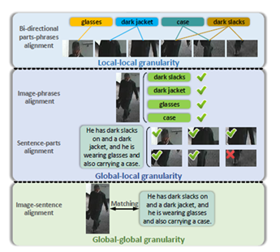

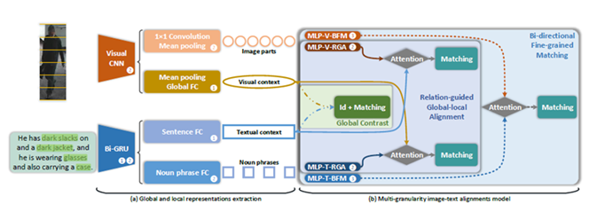

 

 

\2. 2020-ECCV-ViTAA: Visual-Textual Attributes Alignment in Person Search by Natural Language

汇报时间：2020-11-28
汇报人：王海光
主要内容：设计了attribute级别的特征学习网络用于提取特征；采用语义分割和自然语言解析来处理输入的文本；把语义特征相同的图片视作同一类，扩大正样本的数量；将人体图片分块为五部分并手动标注一些类别，在训练过程中同时训练分类的性能(和1类似)。

王靖尧：

这篇论文提出了一种名叫ViTAA模型，用于从特定于属性的对齐学习的角度解决通过NLP任务进Person_Search的问题。 ViTAA充分利用了跨行人身份的视觉和文本模态中的公共属性信息，并通过使用对齐学习模式进一步建立了视觉属性特征与其对应的文本短语之间的强大关联。 文章主要通过对行人图像的解析提取属性信息，利用双向lstm提取文本信息，最后进行特征匹配。

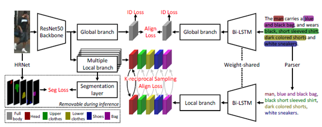

白杨：

提出模型ViTAA，影响力较大，被引用较多次。代码已开源[【code】](https://github.com/Jarr0d/ViTAA)

由“错位匹配”情况出发，作者提出了attribute级别的特征学习。ViTAA采用 global + attribute 匹配。

attribute特征：

- 图像：使用HRNet（预先在多个human parsing datasets上训练的模型）抽取出图像中attribute级别的信息，并以此作为监督信息指导图像的attribute特征学习；
- 文本：使用NLP现有工具将文本解析为attribute级别的短语，之后送入LSTM得到文本的attribute特征。

总的来说，这篇工作通过非常强的先验知识引导模型生成细粒度特征，参考价值并不大。

比较有意思的是使用 K-reciprocal Sampling Algorithm 进行attribute特征的正样本对建立。不同的行人，在局部属性方面却可能相同，例如穿同样的衣服，对于这种情况，在global层面上确实属于负样本对，但通过该算法，可以在attribute层面上建立正样本对。

 

*3. 2019-ICCV-Person Search by Text Attribute Query as Zero-Shot Learning*

汇报时间：2020-11-20
汇报人：王海光
主要内容：率先提出基于文本attribute的person search问题；提出了AIHM(*Attribute-Image Hi-*
*erarchical Matching*)模型应对了这一课题中的噪声、视觉模糊性等问题。

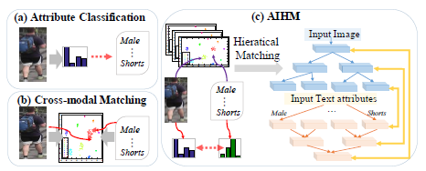

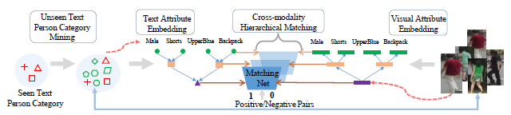

白杨：

模型：AIHM

文章写得有点难以看懂，全文都在说zero-shot，但我没太能理解哪里体现出zero-shot learning的思想。除此之外，本文并非常规的person search，其query是text attribute，也即一系列属性短语（词）。我有点没明白训练的时候query是哪来的，实验用的Market-1501等数据集有text attribute标签嘛？

当然本文也有亮点所在：

- 关于local-level的相似度计算：对于N个图像局部特征和N个文本属性特征，常规做法是对应局部特征做相似度计算，最后取平均值作为整个local-level的相似度。但本文考虑到：1.文本和图像有噪声，不能过分信任数据；2.不同属性词的重要程度并不一致。因此作者提出了一种自适应的融合算法：quality aware fusion。这一点值得借鉴。

 

\4. 2020-WACV-*Text-based Person Search via Attribute-aided Matching*

汇报时间：2020-11-28
汇报人：王海光
主要内容：提出先从文本中提取attribute，再进行特征的分层学习，中层特征是属性驱动的，而高层特征是身份驱动的；提出了语义三元损失，在原三元损失的基础上加入了适应性的margin。

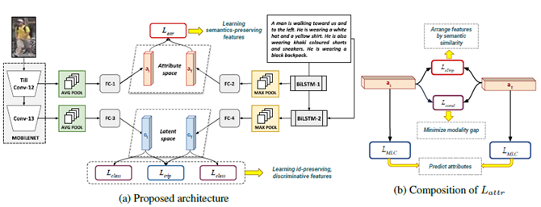

 

*5. 2020-TIP-MAVA: Multi-Level Adaptive Visual-Textual Alignment by Cross-Media Bi-Attention Mechanism*

汇报时间：2020-12-11
汇报人：王海光
主要内容：用Faster-RCNN先对图片进行语义分割，对分割后的部分和文本进行语义匹配；从局部特征和关系两个角度使用跨模态注意力来区分不同显著性的局部；从三个层级衡量图片和文本对齐时的相似度：原实例的全局级别、细粒度的局部级别、文本和图片的上下文关系级别(relation-level，即把图片划分后的一些子模块组成一个对，通过对来衡量文本中的关系表述，比如人在车的旁边(这一点在Re-ID中用的比较少，因而现有Re-ID数据集对动作和实体关系的表述不是很多))

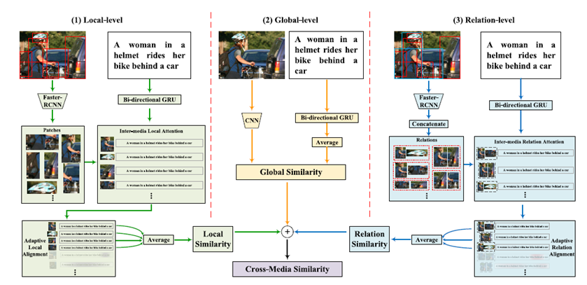

###### 全局级别的关系学习结构

 

 

*6. 2020-ACMMM-Hierarchical Gumbel Attention Network for Text-based Person Search*

汇报时间：2020-12-11
汇报人：王海光
主要内容：首先说明前人text-based-search效果更差的原因：文本描述往往比较注重局部，但是图片给出的是整体信息，所以global-global的匹配会带来信息不对称的问题；使用Gumbel attention(k-top的gumbel trick来自2019ICML *Stochastic Beams and Where to Find Them: The Gumbel-Top-k Trick for Sampling Sequences Without Replacement*，gumbel trick本身更早就被提出)对attention的权重进行采样，减轻了冗余部分对匹配造成的影响；在提取·文本特征时从句子、短语、词三个不同的粒度进行匹配。(不过这篇论文神奇的地方在于对文本搞了一大堆骚操作，但是对于图片提取就是简单的ResNet50+水平分割)

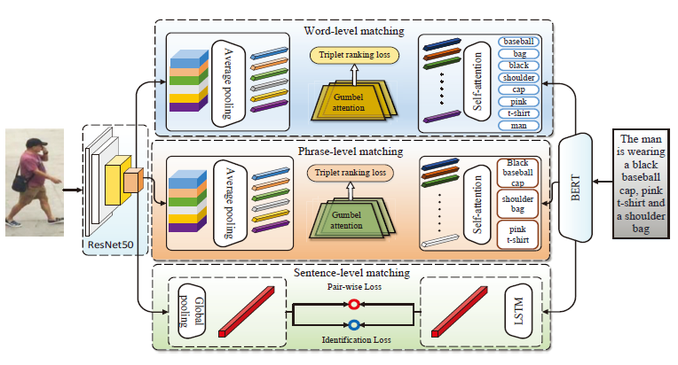

白杨：

模型：HGAN

作为2020的文章，从实验结果来看，还是非常不错的，但是写作是需要被吐槽的，甚至出现了图文描述不匹配的情况，有的地方很难看懂。

总体来说，文章就两个贡献点：多粒度匹配和Gumbel attention。而这两个点也都不是作者的原创。

- 多粒度匹配：分别从sentence/phrase/word-level三个粒度进行匹配。而关于图片phrase/word-level的特征抽取，如果我没理解错的话，作者用的是不同权重的、相同大小的卷积核，并不是以前不同大小卷积核，感觉很奇怪。相似度的计算使用的是MLP，而非简单做内积。
- Gumbel attention：很高大上的词，实际上说白了，作者认为以前传统的soft attention可能会引入不相匹配的噪声信息，因此只想取attention中权重最高的topk个做hard attention（此想法跟NFormer一致，详见[person re-id/NFormer](https://deeplearning-suda.atlassian.net/wiki/spaces/CR/pages/12517518)），而作者认为topk属于离散操作，训练时无法进行梯度回传，因此引入了Gumbel重参数化（感兴趣的可以看看这篇博客：[Gumbel-Softmax Trick和Gumbel分布](https://www.cnblogs.com/initial-h/p/9468974.html)）实现end-to-end的训练。然而奇怪的是，NFormer也是用topk的操作，但并没有认为梯度回传是个问题……

总结：论文包装的很好，一堆高大上的东西，然而实质性的内容很少，论文写作也比较晦涩。参考价值不大。

 

\9. 2019-ICCVW-Cross-Modal Person Search: A Coarse-to-Fine Framework using Bi-directional Text-Image Matching

汇报时间：2020-12-11
汇报人：王海光
主要内容：提出了一种全新的re-ranking思路，将RR从单模态扩展到多模态。具体来说就是prob第一次的rank list中的元素先找到top-k近邻，然后对于top-k的每张图片对应的文本再进行排序，根据prob文本的排名更新这张图片的最终排名。(使用了一个数据集中有但是过强的假设：gallery图片有对应的text，总的来说，意义不大，主要是在传递一个信息：RR没人做，有坑)

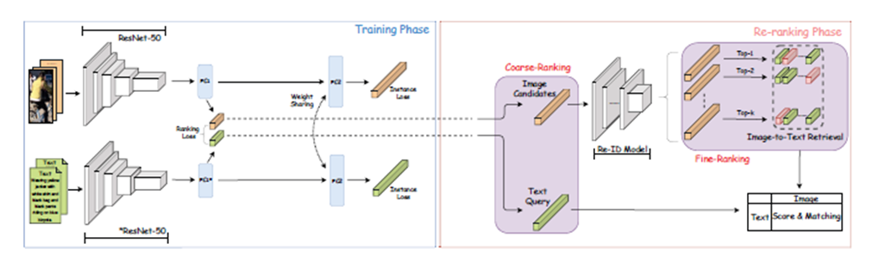

白杨：

模型：BCF

将person reid中的re-ranking思想应用到跨模态的person search任务中。测试时，除了通过训练的跨模态模型做re-ranking，还使用当时SOTA的person reid做图像模态的re-ranking操作。

总体评价：没多少创新点，参考价值不大。

 

\10.  *2020-AAAI-Pose-Guided Multi-Granularity Attention Network for Text-Based Person Search*

汇报时间：2020-12-18
汇报人：王海光
主要内容：把姿态检测运用到person-search中，利用文本中的名词短语和图片中的人体局部建立语义的对齐(具体来说就是检测出人体的几个关键点，例如关节、头，然后把这些点设为1，其他地方设为0，做成一个掩模模板来提取局部信息)。

王靖尧：

文章提出了一种新颖的基于姿势的多粒度注意力网络，用于基于文本的行人人搜索。 提出了粗对准网络和细对准网络，以学习多粒度跨模态相关性。 粗略对齐网络通过基于相似度的注意力选择描述相关的图像区域，而细粒度对齐网络则采用姿势信息来引导短语相关视觉内容的注意力。

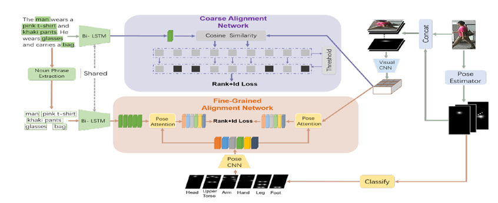

吴梦霞

在粗粒度对齐部分，图片被分割成24块，每块和text做相似度匹配。计算完相似度后用了一个hard attention，这里设置了一个threshold去采样匹配度高的图片块，然后把这些相似度相加作为最后的分数。这样可以筛选出比较有用区域忽略掉不太相关的区域。

白杨：

模型：PMA

此领域第一篇引入姿态信息的工作，方法设计上不可谓不精心，对得起AAAI，值得一读。

总体来讲，PMA从粗粒度和细粒度（patch与phrase级别）两方面实现图像文本的对齐。

细节：

- 粗粒度对齐：姿态信息拼接到图像信息上送入CNN中提取特征。都是比较常规的操作，比较有意思的两点：1.attention计算使用的是文本的全局特征与图像的局部特征。我认为这是非常合理的，文本描述实际上只是对应图像的某几个区域；2.hard attention机制，通过设置阈值过滤掉patch中与文本描述不相关部分。阈值方式相对于传统的topk方式过滤，我认为前者更为合理，毕竟不同的文本描述所关注的patch数量并不一致。
- 细粒度对齐：使用姿态信息分别对图像和文本的局部信息都做attention校正，也是比较常规的操作，不再详述。

 

\11. *2020-TIP-A Convolutional Baseline for Person Re-Identification Using Vision and Language Descriptions*

汇报时间：2020-12-18
汇报人：王海光
主要内容：比较特殊，这篇论文的query既可以是文本，也可以是图片，都是在同一个gallery中搜寻。提出了基于交叉熵的联合优化策略(不重要)以及利用典型性相关分析对跨模态的embedding空间来建模(即，通过奇异值分解寻求最大化两个随机变量线性相关性的统计学方法，对应到任务里就是文本和图片公共的潜在embedding空间)。简而言之，这篇论文就是想构建一个潜在空间和到这个空间的映射，使得互相匹配的文本和图像通过不同的两个方式映射到这个空间后相似度尽可能大。

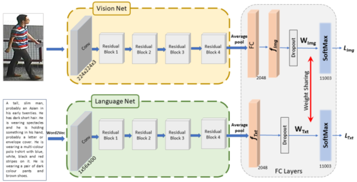

白杨：

与传统person search不同，本文的query和gallery可以是image、text、image+text其中任何一种。

很典型的双流模型，最后使用ID loss做约束，并对图像和文本的分类器做参数共享。除此之外，还使用了CCA，从统计学角度对随机变量做关系极大化。

总结：早期的文章，里面的技巧现在都很常见了，没什么参考价值

 

\12. *2018-WACV-Improving Text-based Person Search by Spatial Matching and Adaptive Threshold*

汇报时间：2020-12-18
汇报人：王海光
主要内容：主要是提了一个适应性阈值机制，来调整其相似度得分。具体来说就是相似度得分小于阈值不处理，大于阈值就把它压缩得更紧凑。contribution一般，但是确实也是因为年代比较早。

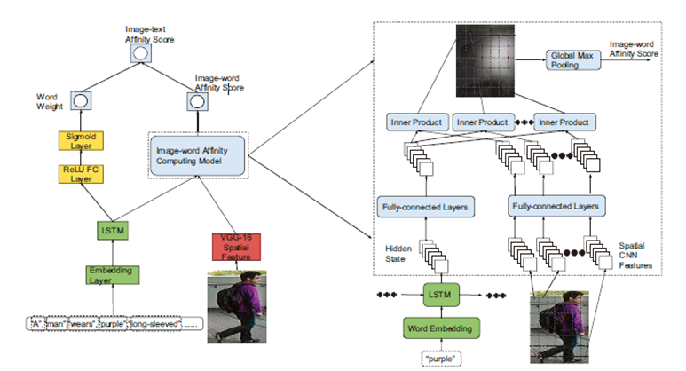

\13. 

 

\14. 2021-arXiv-Contextual Non-Local Alignment over Full-Scale Representation for Text-Based Person Search

汇报时间：2021-1-26
汇报人：李石平
主要内容：采用阶梯式的CNN提取图片三个粒度的特征，采用Bert提取文本三个粒度的特征。通过注意力机制计算特征相似度，进行自适应的多粒度对齐。

王靖尧：

本文提供了一种基于文本的person search的方法，这个该方法可以对全尺寸表示进行联合对齐，称为NAFS。本文使用阶梯状的卷积网络提取不同尺度下的图像特征分为全局粒度，次粒度，细粒度；并使用局部约束的BERT提取不同尺度的文本特征。通过上下文非局部注意力机制可以跨不同尺度自适应地进行匹配对其。

 

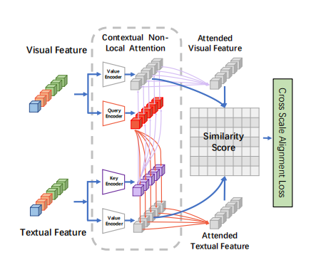

吴梦霞：

Textual representation的提取用的是bert，分的三个粒度分别是sentence、shorter sub-sentence和words。在sub-sentences的特征提取中加了局部限制，就是用一个attention去学习本sub-sentence的信息。与正常attention不一样的是加了一个0-1指示函数，当某个token是属于这个sub-sentence就置1，否则是0。

白杨：

论文逻辑很清晰，提出了NAFS模型，代码已开源[【code】](https://github.com/TencentYoutuResearch/PersonReID-NAFS)

多粒度：1）图像：global、region、patch  2）文本：sentence、sub-sentence、word

作者提出person search任务中的两个关键点：1. 多粒度特征提取 2. 不同粒度特征间的对齐。而本文的创新点正是基于这两点。

细节：

1）多粒度特征提取：对于图片：split & shuffle 操作有点意思，强制让模型只关注stripe内的信息；对于文本：在attention上使用指示函数限制BERT只关注于当前粒度下的信息。但我比较疑惑的是，word级别的特征其实包含了全局信息，即使sub-sentence附加了attention限制，但其attenthon中k、v对象均来自word级别，也就意味着它们附带有全局信息，并不能达到只关注sub-sentence级别粒度的预期。

2）不同粒度特征间的对齐：并不限定于global-global、local-local 亦或者是 global-local 等固定方式的对齐方式，本文采用attention机制，自适应地让特征间相互对齐，特征之间的关注与否，不再具有粒度水平上的限制，而让他们更加专注于语义水平上的对齐。这种对齐方式值得借鉴。

 

\15. 2022-AAAI-AXM-Net: Implicit Cross-modal Feature Alignment for Person Re-identification

李石平：

大部分之前的工作是先分别学习图像和文本的特征，再对特征进行对齐。这篇工作在特征学习阶段可以隐式的学习到两种图像和文本间的对齐语义信息，并且不需要用到属性、人体分块等额外信息，通过这种机制可以学习到更多人体信息，并且摒弃背景信息。

王海光：

这篇工作的特点在于：利用上下文信息来压制不同模态间噪声信息的权重。

部分实现细节：

\1. AXM模块：对于上面提到的上下文信息，文中文本和图像两个模态都用了若干不同感受野大小的卷积网络，然后把不同卷积网络得到的两个模态的一坨特征全部塞进MLP，最后得到两个特征：文本模态注意力加权特征和图像模态注意力加权特征，跟不同感受野的特征做点积

\2. 压制噪声的方法主要是AXM模块（就是上面说的那个），作者说：文本不会描述图像中那些不显著的背景信息等，过了AXM后，那些图像有而文本没有的信息就会被减弱，从而达到减少噪声信息的效果。

顺便吐个槽：

1. 全文到处都提到了注意力机制、显著局部这些词，但是实现方式清一色MLP，没有任何transformer
2. 这篇论文的实验简直堪称强迫症，进行了V->V（传统行人重识别）、T->V（person search by language）、VT->V（上述二者结合）三个层面的效果对比
3. 论文强调了处理AXM提取出的图像特征时（主要是所谓的“压制噪声”）再次利用上下文信息的重要性，但是其实现方式令人大跌眼镜：仅仅是共享图像局部的特征提取网络的参数（我没看错的话，论文原文就是这么说的，欢迎指正），似乎与其说法还是有出入。

代码：无

情况：我下的论文早期版本和现在的版本出入很大，且至今仍在arXiv上，应该是被拒后大修过了

启发：

1. 实验做的真的很棒，可以说是我见过最有含金量的SOTA，但是全文很多地方都挺不明所以的，被拒也侧面说明了其与当前主流不甚相符
2. 如果真如作者所说，文本和图像过AXM的途中，两边的差异信息会被减弱，那么是不是可以以此达到自动筛选有效局部，而不需要额外的局部划分手段（如faster-rcnn等）

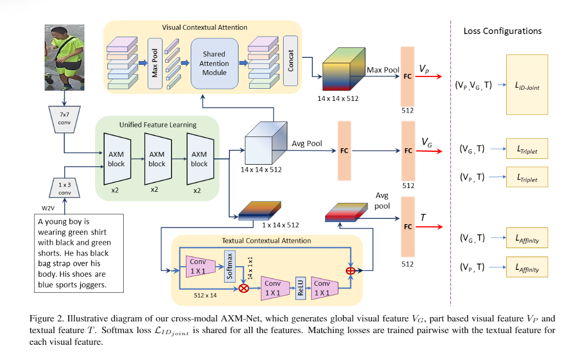

白杨：

先吐槽一下， AXM-Net于2021年1月发布于arXiv，标题前后换过三次，应该被拒稿多次，终于在今年被AAAI接收。拒稿原因从论文中不难看出，写作太迷了，再加上没有公开代码辅助理解，我前后读了多遍都很难理解。实验结果很高，但通过写作并不能直观传达出模型的优势。

AXM-Net最大的创新点在于先通过融合网络后送入各自分支模块得到图像、文本特征，这样做的优势在于融合期间就使用了文本做监督信息，摒除了背景噪声的影响，同时在融合期间就隐式地进行了特征对齐（对应标题中的 Implicit Cross-modal Feature Alignment），因此后续图像的局部特征不用借助外部的信息（例如关键点、行人姿势标注等等）就可以获得。

而本文最重要的模块是AXM-Block，如下图所示：

多尺度特征抽取，实际是对通过backbone后的特征图进行不同尺寸的卷积操作。不需要借助复杂的人工操作或者额外网络（例如目标检测网络、文本解析网络等等），只通过控制卷积核大小而得到不同尺度特征，这一点值得借鉴。

问题是，作为跨模态语义对齐模块的AXM-Block，从始至终都采用的是MLP，从论文里并不能看出有跨模态的对齐，从公式(2)仅能看出多尺度的特征融合，但这种融合仅仅是单模态下的，也并没有体现跨模态的思想。在实现细节里，作者也说图像、文本特征是分别抽取的，也丝毫没有跨模态融合的概念。

总结：结果很好，写作很迷，前后矛盾，难以理解……

 

19.2021-TIP-Learning Aligned Image-Text RepresentationsUsing Graph Attentive Relational Network

李石平：

用CNN提取图像特征，对feature map采用水平分割和平均池化的方式提取局部特征和全局特征。

采用Bi-LSTM分别对整个句子以及句子中的名词短语提取全局特征和局部特征。

使用GNN进一步提取文本特征。通过graph attention network学习每一个名词短语属于某个图像局部的概率，实现聚类。

 

王海光：

核心思想：主要就一个：利用GNN对文本短语之间的关系进行建模表示，比如“a bag on a blue jacket”，只靠”bag”的话信息就会有所丢失。

代码：无。

实现细节：

1. 整体框架：
   1. 图像流：使用CNN对图像提取grid化的特征，随后水平划分，其全局特征通过平均池化实现。
   2. 文本流：使用NLTK实现短语提取，随后用双向LSTM获取特征（全局&局部，全局实现方式下面会讲），然后用GNN（Skip-GNN+Graph attention）对特征进行融合。
2. 特别地，这篇论文对文本“全局特征”的实现有自己的理解，采用的是双向LSTM中两个流的最后一个词的隐状态（分别是句首和句尾）的拼接。
3. 关于Skip-GNN：这里用了一个图残差神经网络，就是将Resnet和GNN结合起来，具体来说就是更新图神经网络在时间步t的状态时加上它在t-1的状态。特别地，这篇论文的节点更新在图神经网络基础上还融合了LSTM，具体来说就是把时间步当做序列。
4. 关于GAT：说实话没看懂。作者说的是“注意力权重矩阵的计算和普通GNN相同”，但是不管怎么想，普通GNN在传输过程中的权重是用和边的连接性。

顺便吐个槽：

1. 这篇论文看着发的比较晚，其实工作做得相当早，仅仅是因为刊发的慢所以才造成这篇论文是2021年的错觉。在SOTA对比的时候，最高的对比对象都还是CMPM+CMPC。

启发：

1. 实验量相当足（毕竟是TIP），不光测试了text-based person search的数据集，还测试了bird search数据集Caltech-UCSD、flower数据集Oxford-102、text-image retrieval数据集Flickr30K。模型的鲁棒性还是非常强的。
2. 这个真没啥启发。。。这篇论文工作做的太早了，以至于现在这些看着很强的套路都已经被玩烂了。（顺便一提这也是谭铁牛组的，感觉他们发TIP好容易啊）

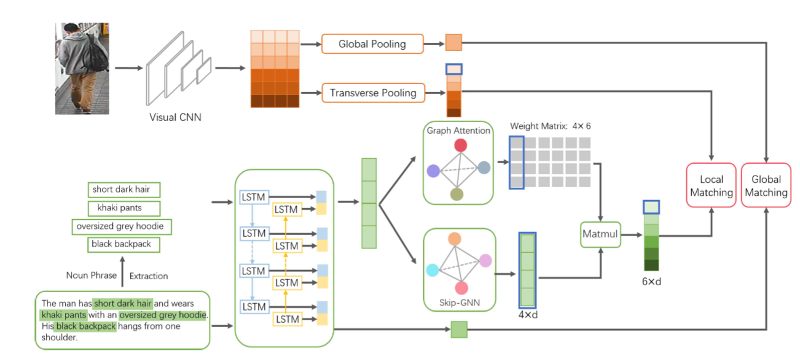

 

吴梦霞：

Skip-GNN的作用是学习不同的名词短语之间的关系，这个关系表明它们是否应该属于一个图像区域（比如“with a phone in his hand”，phone和hand是两个名词短语，但是它们应该属于一个图像区域），graph attention学习的是一个权重，表示的是名词短语属于某个具体图像区域的概率。

 

\25. 2021-arxiv-Semantically Self-Aligned Network for Text-to-Image Part-aware Person Re-identification

吴梦霞：

这篇论文的亮点在于Part-level Feature Extraction。模型整体通过权重共享来加强文本和图像的语义对齐。

1.在image的处理中，学习了不同part之间的关系。对于每个水平切割的part，通过计算它与其他part的相似度来融合其他part的特征，作为最终的part-level representation。

2.在text的处理中，它把image的每个part作为基准，通过算每个word和image part的相似度去学习word之间的关系。

3.在损失中，把相同identity的不同样本对应的文本描述作为额外的弱监督（可认为是一种data augment），加入到优化损失中，可以减少文本特征的intra-class差异。

王海光：

整体框架和*MAVA: Multi-Level Adaptive Visual-Textual Alignment by Cross-Media Bi-Attention Mechanism*非常类似。

针对的问题：1. 借助外部工具划分文本局部（即提取名词短语的操作）会使得文本的特征质量依赖于外部工具，并且忽略了文本短语间的关系。2. 每个图像-文本对都需要进行处理，计算开销太大。

解决方案：1. 针对问题1：对于图像和文本的每个局部（横裁出的图像块和单词），计算其与其他同模态的局部的注意力权重，从而然后按照该权重对其他局部加权，得到一个伪特征

将伪特征与原特征相加并映射得到该局部新特征

这样，每个局部的特征就可以通过训练引入其他局部的特征。

\2. 针对问题2：首先，所有图像采取水平六等分的局部划分方式。然后，引入六个线性层，每个都可以用于计算一个词属于局部 i 的概率，这样，文本的特征提取就可以化为（s表示概率，e表示word embedding）

（由于每张图像遵循相同的划分，所以在所有图像-文本对中，文本都可以采取相同的方式计算E，这样文本的特征提取就可以独立于图像，从而避免了每个对计算一次的尴尬现象。）

\3. 针对loss：以往的工作仅将标注数据时每张图像对应的两段文本和该图像构成正对，但是作者认为，该图像对应ID的其他图像所对应的两段文本也可以作为弱正对。于是作者提出了CR损失

其中D'表示图像对应ID的其他图像所对应的文本，D表示每张图像对应的文本，特别注意的是a2不是固定的，因为作者认为其实同一个ID的不同图像有时候也不一定很相似，所以triplet loss对于这种ID相同但不对应的图像-文本对的margin很难设定一个定值，于是a2按如下方式计算：（这样匹配度比较低的文本就能获得更大的margin，即对它更加宽容，从而避免过拟合）

启发：

1. 我更关注的是本文对复杂度的处理，如果图像的局部划分能够范式化，并且文本也能对这种划分做出范式化的解决，那么其实复杂度的问题就可以迎刃而解了。
2. 如果能把CR loss动态margin的理念应用到整个triplet loss中，会不会对过拟合有所提升呢？

代码：[https://github.](https://github/)com/zifyloo/SSAN

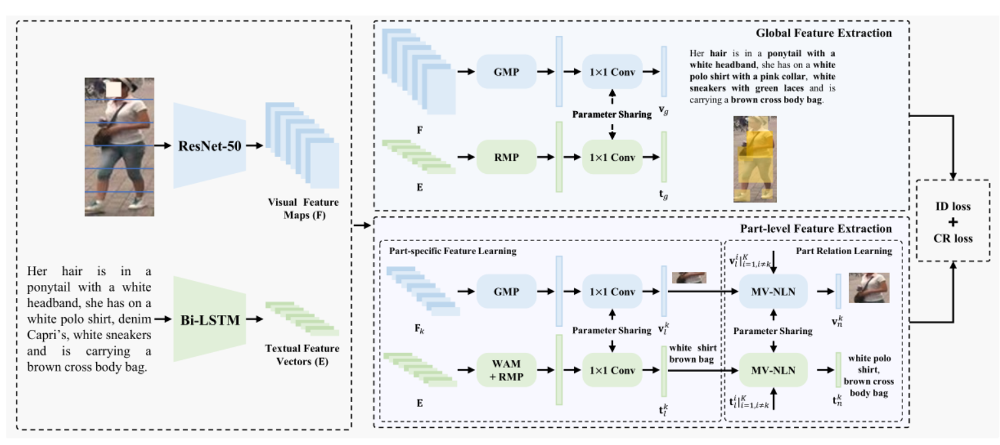

白杨：

很棒的一篇文章，非常值得一读。

提出模型SSAN，代码已开源[【code】](https://github.com/zifyloo/SSAN)，并且提出新的数据集 ICFG-PEDES。

在person search领域做跨模态特征对齐时会存在两个问题：1. 如果使用cross-attention机制做对齐，那么对每一对图像文本都要做计算，计算开销太大；2. 如果借助额外工具（如NLTK等）做局部划分，那么局部特征的性能将受制于额外工具的表现，除此之外额外工具也会破坏上下文中的语义环境。

由此，作者提出了自适应的语义对齐网络SSAN。**核心是使用水平划分的图像局部特征监督文本的局部特征学习。**SSAN中有价值的、有创新力的是PFL、PRL模，它们被用来抽取局部特征，以及CR loss。

- PFL：图像分支自不必说，直接对特征图做水平均匀划分；文本分支引入了WAM结构，被用来做词与图像局部关联度的推测，即预测单词应当在描述图像中的第几个划分。
- PRL：用来解决图像均匀划分的问题，在图像中，某些特征并不单单属于某一划分，因此使用模态内的attention机制对不同划分下的特征做了融合。因为前一步文本局部特征是根据图像均匀划分下学习的，一旦图像的划分被纠正，文本也要因此被纠正，所以PRL也会作用于文本。
- CR loss：和以前看过的文章不同，本文会把正样本（同一个人对应的图片和文本）划分为强正样本（图像与其对应的描述文本）和弱监督正样本（虽然是同一行人，但文本描述的是另一张图片），之前大家好像都会同等对待，但本文基于两者不同的权重。此外在loss设计上，作者还引入了动态调整margin的小技巧。

最后，权重共享策略体现于SSAN的各个角落，我认为权重共享是另一种实现特征融合的手段，相较于cross-attention，前者无需引入计算开销。此方式在其他论文中也多有体现，值得借鉴。总的来说，SSAN确实实现了自适应的特征对齐，但又完全是双流模型，运行效率也很高，是一项非常不错的工作。

吐槽 ：作者在论文中多次提及权重共享的1*1卷积，实际上就是权重共享的线性层，和传统意义上1*1的卷积似乎并不相同。。。

 

\26. 2021-Neurocomputing-TIPCB: A Simple but Effective Part-based Convolutional Baseline for Text-based Person Search

李石平：

图像通过resnet提取特征，文本先经过不参与训练的bert提取word embedding，再经过text CNN提取文本特征，用 GMP 聚合低级特征图得到视觉的低级特征。对高级特征图使用 PCB (水平分割) 策略提取局部特征，取这些局部特征向量各个元素位置上的最大值构成全局特征向量。最终，得到 low-level、local-level 和 global-level 的三种特征。测试阶段只有 global-level 被用于相似度衡量。

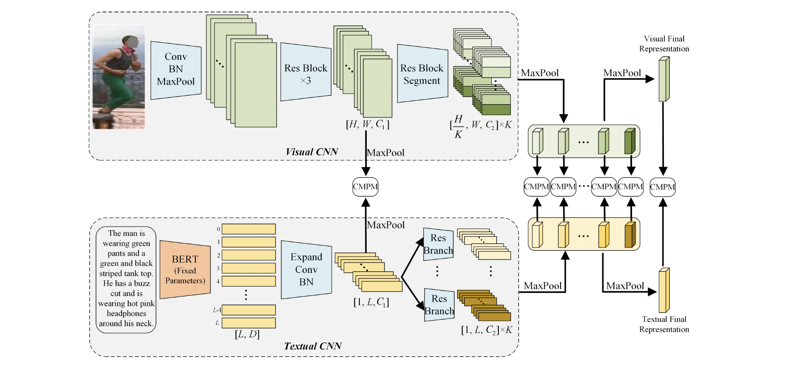

白杨：

提出模型TIPCB，代码已开源[【code】](https://github.com/OrangeYHChen/TIPCB)

写作很流畅，逻辑很清晰，实验设计也很合理详尽，实验结果也很好，有点没想明白为什么会发在Neurocomputing（CCF C刊）。。。

TIPCB将特征分为三个层次，low-level、local-level 和 global-level ，并分别对三个层次的特征进行CMPM的约束对齐。low-level指卷积网络较低层的feature map，local-level和global-level来自较高层的feature map。对图像而言，local-leval通过对较高层feature map做水平划分，对文本而言，TIPCB使用了多个残差网络做自适应的局部特征提取。global-level使用MaxPooling作用在local-level特征上得到。整个网络结构总体来看还是比较简单的。

细节：

- TIPCB在训练时将BERT参数完全冻结，仅仅是将其当做word embedding层。
- 对于提取文本局部特征的残差网络，其层深并不大，仅仅是3层网络。其原因是文本信息是离散型，深层网络并不能带来提升。这一点在其他工作中也有证明。
- 从消融实验来看，带来最大提升的是local-level与global-level的组合，也即说明通过MaxPooling获得global-level特征的方式比较合理？

思考：

- 本文亦是由水平划分的图像局部引导文本局部特征的学习：文本经由多个残差层提取到的局部特征自适应地与图像局部特征对齐。这不仅让我想到了师兄的工作：对图像和文本都不做先验划分，而是都自适应的对齐，可否在此基础上引入先验知识校正对齐方式？说起来，我至今都没想明白师兄模型的工作原理。。。从实验结果来看，是否对模态内的局部特征加入正交约束都影响不大。很难理解不加正交约束，模型为什么不会关注相同的局部，又或者说ViT本身的强大特征提取能力总会使得不同头关注于不同局部？

 

\27. 2021-ACM MM-DSSL: Deep Surroundings-person Separation Learning for Text-based Person Retrieval

李石平：

图片中的信息可以划分为互斥的两部分，背景信息和行人信息。文本中也包含一些语义无关的信息。这篇文章提出了一个人体-背景分离方法，能够将图片中的人体和背景信息分离，从而更准确地提取人体信息，同时能去除文本中存在的噪声。综合了五种对齐范式，从而更好地实现跨模态对齐。

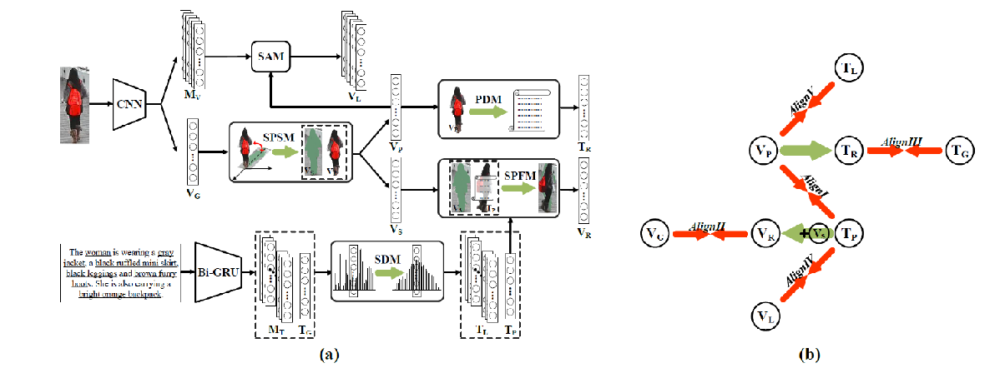

\28. 2021-ICCV-LapsCore: Language-guided Person Search via Color Reasoning

李石平：

颜色信息在匹配中极为重要，本文提出了一个新的特征学习方法，通过借助两个颜色解析子任务，能过够显式地学习跨模态细粒度联系。其中两个子任务如下：(1). Text-guided Image Colorization,以文本信息为引导，对灰度图进行着色。(2). Image-guided Text Completion. 将文本中所有颜色相关的单词mask，再借助图片信息预测被mask地单词。

王海光：

核心思想：很有意思的工作，以往的person search都是基于短语找应的图像局部，这个课题是基于RGB图像找文本提到的每个部位（比如衣服、帽子等）的颜色并填进文本（TC）+利用文本对灰度图上色（IC）。

代码：无

具体细节：

1. IC：灰度图上色采用UNet，该网络是一个encoder-decoder结构。文本特征通过LSTM提取，并利用channel-wise的transformer将文本特征融入图像特征。（比较简单，也没有创新点，不多赘述）
2. IC的泛化：关于上面这个上色模块IC，作者后面提到了：“在类似于MSCOCO这样的泛化的text-image数据集中，颜色往往不是数据标注时重点考虑的对象”。所以作者对自己的方法做了泛化。本文中的“对灰度图上色”，其实可以理解为根据HSV图像的一个channel的值结合文本信息来预测其他channel的值。所以作者选择了掩盖图像中的部分channel，来预测这些被掩盖的channel。
3. TC：作者把句子中所有的颜色词mask掉，然后将整个task看成一个特殊的VQA问题：“xxx身上的xxx是什么颜色的？”。使用的网络是VQA里的BAN，也没什么创新，不展开叙述。

启发：

1. 怎么说呢？个人觉得整个模型就是一个双向的生成模型，这个工作其实text-image有类似的，但是又做了一些退化，把直接生成伪文本和伪图像退化成生成颜色和图像上色，但对person search来说，很显然够用了。因为这个过程更多应该是让模型注意到文本对应图像区域。
2. 作者全文提出的新方法很少，几乎都是现有的框架，但是核心在于自己提出的颜色注意的理念，并用现有方法实现自己的这些理念，可以说是让我感觉望尘莫及了。
3. 作者其实在泛化IC的时候隐式地向我们揭示了一个点：person search数据集区别于普通text-image retrieval数据集一个很重要的特殊性就在于它对颜色的把控，这也是我们日后做attention时可以着重考虑的点，结合person search的特殊性。
4. 可能是我最近在研究相关内容的原因，其实我还蛮care这个模型的复杂度的，因为我看这些模块都挺复杂的。结果人家测试的时候根本就没做笛卡尔积式测试（笑哭），人家直接拿文本和视觉特征做矩阵乘法。也就是说其实后面那些IC和TC任务本身都不重要，目的都是为了训练前面的特征提取模块，让它们提取出的特征更加鲁棒。看完之后我有些反思是不是我在我的方法上太死板了？其实没必要一定要final phase的特征，后面的模块可以仅仅当做是为前面的模块指引优化方向的。（不过这篇论文其实对测试阶段提的非常少，我不确定我的理解是否完全正确，如不当造成误导，深表抱歉）

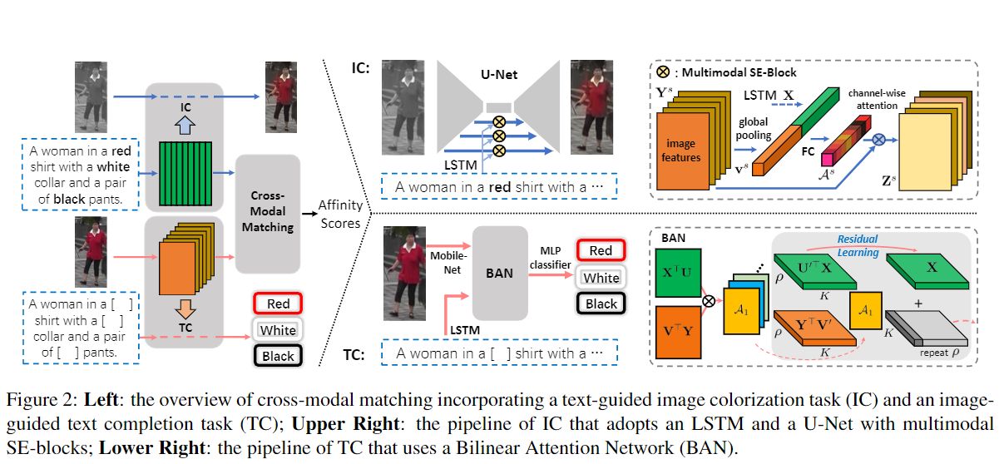

\29. 2020-Relation-aware aggregation network with auxiliary guidance for text-based person search

李石平：

图像通过Bottom-Up Attention 得到局部特征，经过多层GCN学习局部与全局间的关联，文本通过Bi-GRU编码。经过self-attention和Average Pooling之后得到最终的全局特征表达，通过全局特征计算相似度。

值得一提的是，引入三个额外子任务，引导特征的学习以及跨模态关联的挖掘。
(1)Gender classification，文本中包含性别信息如(male, female, her, he等），对图像底层特征进行分类。
(2)Appearance similarity regression，通过一个额外的训练好的Person ReID模型提取一份图像特征，这个特征和文本特征存在gap，但样本之间图像的相似度是可参考的。因此约束训练得到的任意两个样本的图像与文本相似度 S(v_i,t_j) 与ReID模型得到的图像相似度S(V_i^0,V_j^0)一致。
(3)Generation task, 加入一个image caption任务学习图像文本间的关联。

王海光：

核心思想：去年的这个时候，幼稚的我曾经说过“为行人这种简单的拓扑结构建图意义不大”。然后现在被打脸了，这篇文章就是用GNN来建模关系信息的。还有就是，这篇文章对我上面提到的“后置子任务模块”起了个非常专业的名字：Auxiliary guidance module，附加指引模块。这篇论文唯一的问题是它发的有些早了，其实它57的效果已经不够SOTA了。

代码：无

相关细节：

1. 这篇论文的visual backbone是我见过最奇葩的，用的是在CUHK-PEDES上预训练的Comp ReID（一个ReID网络），作者还用了”significant”来形容person-reid的结果。（可惜的是没给数据，我也没办法验证）你以为这就完了？naive。这个才是全局特征的backbone，作者局部特征提取又搞了另外的backbone…..用的是在Visual Genome上预训练的bottom-up attention。（所以这个全局和局部提取的特征都不在一个空间里，作者可以说是很反人类了）
2. GNN模块：建图的方式也很无脑，直接搞了全连接。（顺便一提，作者在阐述引入多层GCN的意义时提到了一句：扩大感受野。说实话我挺无语的，全连接还扩大感受野。。。这个作者的理论知识有些欠缺）
3. 辅助模块：主要分三类：性别分类、外貌相似度回归、文本生成（大杂烩属于是）。第一个任务没有理解难度，跳过；第二个任务是用Comp ReID(teacher)在Re-ID任务上对所提出模型最终特征(student)进行蒸馏；第三个任务是利用图像信息来生成文本，并和原本的query进行相似度计算。
4. 数据增强：作者有个数据增强也挺好玩的。GCN输出的特征在进行self-attention之前先随机打乱一下顺序，使得每个patch每次的position都不同。不过有意思的不是这个，有意思的是，所有的消融实验设置里，加上这个数据增强方法后效果都基本没变(<=+0.3)，甚至有的还下降了，但是作者仍然锲而不舍地把它加了进去。

顺便吐个槽：

1. 从作者的消融实验来看，整个模型里GCN其实没涨点多少（0.4%），起作用的是Comp ReID提取的全局特征和自注意力模块。（所以加上GCN就是为了novelty而novel）。而这句话同样可以用在他的改变patch的position和蒸馏两个模块上。（绝了，三个新的模块，全部自己用消融实验证明自己没用）

启发：

1. 没有做不出来的idea，只有做不出来的人。
2. 但是这篇文章做得还是太水了（建图方式太简单，目标检测的输出稳定性难以保证，子任务纯靠堆，消融实验自己打自己脸）（一共三个我觉得还比较新的点：GCN、Re-ID蒸馏和打乱patch顺序，结果居然还没用……），实在是让人难以认同它。（毕竟一篇CV文章投了WWW说明工作上限也就那样了）

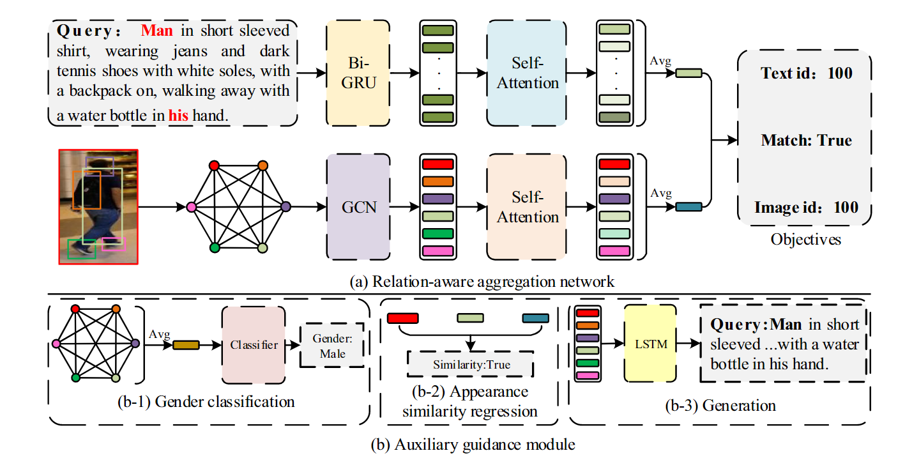

白杨：

模型：RANAG

不值得看，浪费时间。能发WWW（CCF A会）就很离谱。

唯一有价值的一点，在于作者对生成任务的消融，也即使用之前的词特征和图像特征对当前词做预测。以前考虑过这个任务，但后来再一想，即使不用图像特征，只使用之前的词特征也能对当前词做预测，就像BERT中的MLM一样。那么这个任务是否还有意义？似乎并不能学到跨模态的语义关系。但这篇文章从实验上证明了还是有一定效果，虽然不是很大就是了。

 

\30. 2021-BMVC-Text-Based Person Search with Limited Data

王海光：

核心思想：这篇论文严重标题党，表面上说是'Limited Data'，实际上根本没有减少数据集的数据数量，这里的'limited'是对CUHK-PEDES的形容词，意思是吐槽它的数据太少了，不够作者训。为了解决数据少的问题，作者这里是用了对比学习（解决方式真的是简单粗暴）。效果确实是到SOTA了，代码也确实开源了。但是方法论上更多只是对现有方法的拼装，个人觉得参考价值其实很有限。

代码：[GitHub - BrandonHanx/TextReID: [BMVC 2021\] Text-Based Person Search with Limited Data](https://github.com/BrandonHanx/TextReID) （这里吐槽一下，这个作者代码开源了，但是非常乱且不完整，README也没有任何细节，只有他本人的一句：到CVPR截稿后才能重新整理）

具体细节：

1. 个人在看到这篇论文的时候感觉仿佛过了一遍以往person search和对比学习论文的走马灯。Identity Loss+Align Loss，transformer，CMC Loss，MoCo，预训练。几乎是以往能叫上名字的论文这里都有。
2. 作者可谓是财大气粗的典型，一张V100卡，光是文本输入就先过一遍CLIP（没错，CLIP都上了，在WIT上预训练过），再过一遍GRU，最后Max-Pooling。
3. 作者在测试阶段只取文本和图像的Query编码器，把文本和图像分别编码成特征，然后矩阵相乘。
4. 对比学习也没啥特色，就是在数据集中同类替换，模型是MoCo。
5. 作者的backbone很有意思，不是纯的一种backbone，而是CLIP和LSTM或者CNN的组合。这里其实还挺神奇，为什么有了 性能更强的CLIP还需要加上LSTM和CNN这种相对来说性能更弱的编码器呢？

启发：

1. 在具体细节里提到的，测试阶段只取两边的Query编码器，然后还是矩阵相乘。所以说这篇论文某种意义上也可以算作是特征提取器+训练阶段专用子任务的结构（从这篇论文往上的四篇几乎全部是这个结构，我认为这个结构可能已经超越了以往的局部匹配成为新的潮流）（说不定是大家都被复杂度弄烦了）。
2. 作者在论文里简略地说了一个很有意思的东西：他吐槽说以往的Bert+Resnet结构不行，因为它们预训练的数据还不够（？？？？这就是大户人家吗？）所以他要先去MSCOCO、Flickr30k、WIT先微调一遍，然后进行微调的微调。这里出现了一个很有意思的结果，效果基本始终只提升了1%。作者本人的解释是这些广义V2T数据（MSCOCO那些）和cuhkpedes之间有gap，广义数据集比较注重全局，不注重细节。这就很有意思了。按照我们的直觉，本来在文本和图像上分别训练的Bert和Resnet之间gap应该大得多，最后却反而被一个跨模态但是仅仅没有注重细节（我个人觉得MSCOCO也不至于完全不注意细节）打败了？

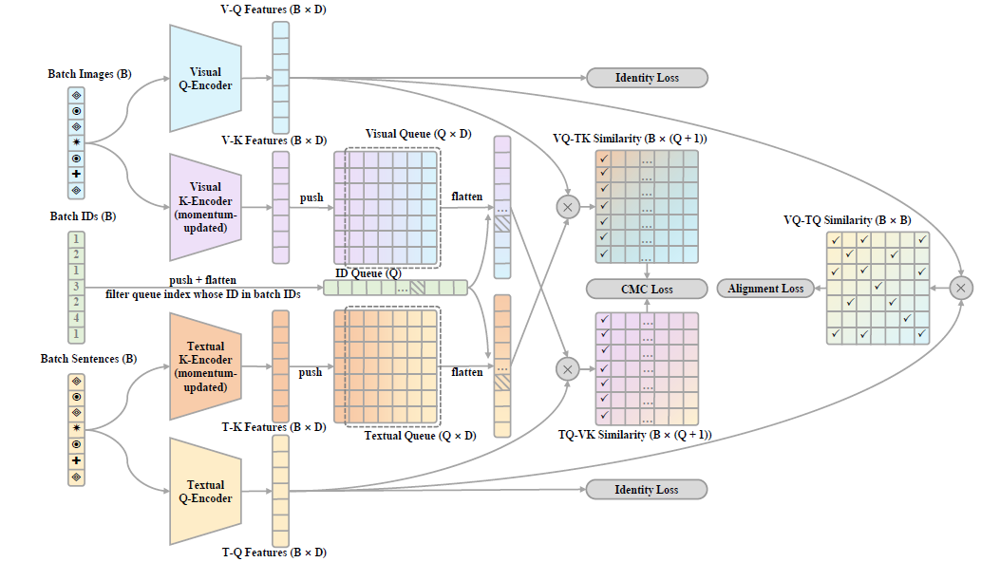

白杨：

关于当前person search任务具有挑战性的原因：1）训练数据少，对应论文标题的 limited data 2）细粒度的跨模态检索任务，以前通用的、粗粒度的ITR预训练模型难以直接应用在此任务上。

此模型与ALBEF的双流模型非常相似，并在此基础上额外增加了联合训练，额外新增了 alignment loss 和 identity loss（可供之后的工作做参考）。

当然，模型性能提升的关键并非是上述的loss选择，而是本文提出了一种很好地将之前粗粒度跨模态预训练知识迁移至细粒度匹配任务的迁移策略，这个策略直接使得模型表现上升一大截。这也是本文最大的创新点。

 

\31. 2021-ICCV-Weakly Supervised Text-based Person Re-Identification

王海光：

核心思想：这篇论文其实有些标题党，他所谓的weakly supervised并不是我们传统印象里的weakly supervised，而是只剔除了id，文本和图像的对应信息还是有的，作者给了个很直观的图说明它和有监督训练的区别。总的来说，方法都很简单，亮点不多，8页的论文loss写了两页半。

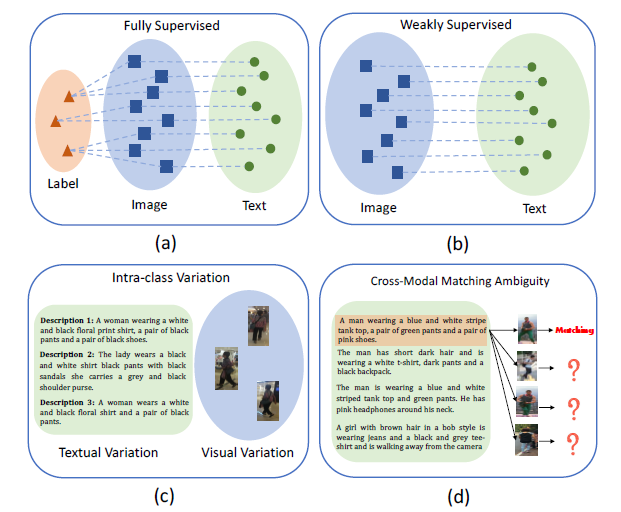

 

代码：[GitHub - X-BrainLab/WS_Text-ReID](http://github.com/X-BrainLab/WS_Text-ReID)  

相关细节：

1. 很多想法其实都很自然，也很简单，提取文本和图像的特征后，很自然地开始聚类，不过他这个聚类方法很有意思，出自论文*Self-paced contrastive learning with hybrid memory for domain adaptive object re-id*。（这篇论文我觉得对非监督对比学习匹配任务都能用）利用memory来维护聚类中心。完成这一步加上id伪标签后其实这个任务就已经变成传统的person search了。
2. 提取完特征后，对两个模态内部各自进行对比学习。不过它这个对比学习比较奇葩，甚至算不上对比学习。因为它只有一个正样本，对于已聚类样本来说，正样本是聚类中心；其他样本的正样本是它自己（这里我读了好几遍原文，想尽全力发现我是错的，正样本是自己这是实在太搞笑了，但是我读了好几遍，最后觉得原文的意思确实是这样的，如果我理解错了，还请大佬指正）（所以这更像一个筛选后的triplet loss而不是对比学习）。
3. 唯一感觉对聚类做了一些改进的地方就是对于未聚类样本，采用另一个模态的聚类结果来辅助更新。整体流程比较饶人，但是实际上没有很复杂。具体来说，如果存在一个尚未聚类的文本t，那就先看看它对应的图像v有没有聚类，如果有，就在图像所属的类内寻找和图像相似度最高的图像v'，然后看看图像v'对应的文本t'，如果t'有类别，就把t'的聚类中心作为t的聚类中心；反之则继续查找和v相似度次高的v''，直至v所属的类被全部查找完。
4. 作者有个Text-IoU我觉得还是很有意思的。由于缺少id信息，所以作者以一种很特别的方式给了标注。首先提取两段文本的名词短语，然后求他们的IoU(交集词数/并集词数)，以此来作为两个对之间相似度的软标签。
5. 特别说下这篇论文的效果。rank-1是57%，高于ViTAA，但是和再后面的比起来就不行了（不过作者最高只放了ViTAA，不知道是投的早还是故意的），另外，baseline就是直接只利用对，而完全丢弃id，只有标注时配对的文本图像（也就是说每张图像只有2个正文本对，每个文本只有1个正图像对），也不进行聚类，而这样的模型效果都到了51%。考虑到它是半监督的，这样的结果其实已经很高了，而从这样的实验结果中，我们不难有如下思考：为什么一个这么简单的模型结构，还是半监督的，能超越有监督的模型？有没有可能本身的id标注对训练其实并不友好？反而是聚类的伪id有助于模型学习特征？

启发：

1. 个人觉得Text-IoU还是很有启发的。之前我们就曾提到过，在person search中，两个id不同的行人未必完全不相关，可能穿着同样的衣服，留着同样的头发，甚至衣着完全一致，但是就是id不同，如果盲目用01来表达它们之间的关系，可能会丢弃这些局部相似信息。
2. 这里的伪id也照应了第1条，对于两个各方面都很相似，但是只是标注给出的id不同的样本，是不是应该做一些改进，让模型能够做出辨别？

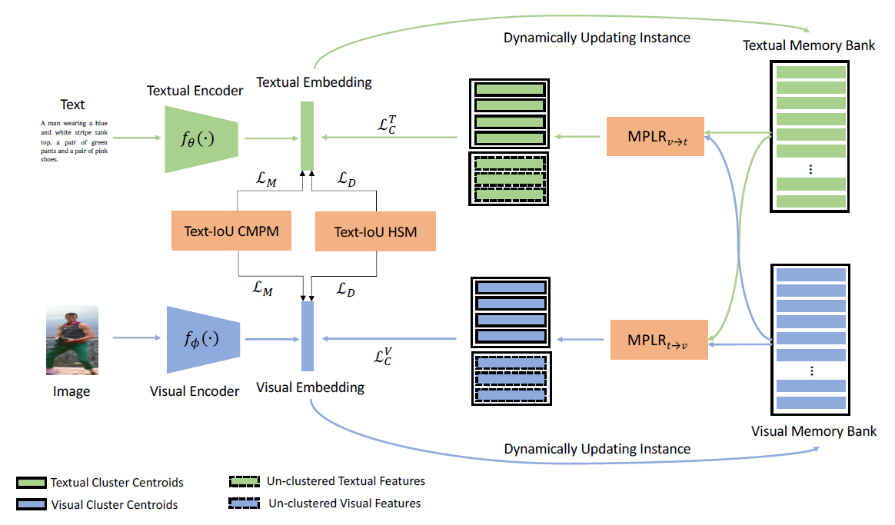

\32. 2021-ICMR-Text-Guided Visual Feature Refinement for Text-Based Person Search

王海光：

核心思想：这篇论文其实跟我们之前提过的一个小idea高度类似：用文本来作为attention的query，引导图像局部进行加权。论文着眼于一个很现实的问题：之前的工作很多都采用了image-guide attention来对text中不同的单元进行加权，但是这样的话，有可能导致一个和文本不匹配的图像通过这种加权过滤掉了文本中和自己不匹配的信息，最终使得这个不匹配的图像和文本的相似度也很高。（这一点其实我们之前分析文本主导的好处的时候没有分析出来）。但是虽然这篇论文是21年发的，效果甚至不如18年发出的ViTAA，所以基本当个参考就行。（而且这篇论文漏引严重，都引用20年的MIA了，居然不知道18年的ViTAA和其他SOTA模型？）

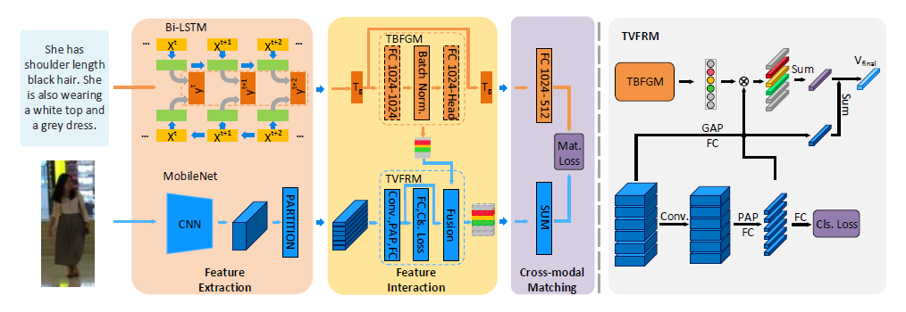

相关细节：

1. 作者提了一个很有意思的发现：如果我们像早期的工作一样把行人图像水平六等分，那么其实每个文本属性都会倾向于出现在这六块中特定的第k块，举个例子，“帽子”这个属性就容易出现在最上面那一块。作者由此认为分析文本中的属性就能大致知道这些属性出现在图像中的位置，而不需要有任何图像信息的介入。因此作者仅利用文本特征生成了对图像局部特征加权的权重向量。
2. 作者生成图像局部的过程很有意思。首先由Mobile Net得到feature map，然后对feature map进行水平划分，得到k个子feature map。随后对子feature map先进行1*1卷积（据说是为了精炼每个水平条局部内部的特征，我没太理解他的意思，猜测可能是为了防止感受野过大导致最上面水平条内的feature map的特征可能实际上包含第二个水平条的特征。具体还请各位自行查证，如有发现，敬请指正），然后对每个feature map进行平均池化得到1*d的局部特征向量，然后又经历了一次线性映射（这边我没太看懂，前面那个1*1卷积不是明明可以跟这次线性映射合并吗？那为什么要分两步？）。然后作者加入了一个判断每个局部特征属于6个局部中哪一个的预测层，这个预测层预测的结果计算一次损失，从而实现每个局部的特征都更加显著。
3. 上述做了这么多操作后，作者最终的图像特征是图像本身的全局特征加上文本特征生成权重向量乘图像局部特征向量，公式表示就是v_g+\sum(a_i*v_local^i)。

启发：

1. 我觉得这个提取局部特征过后再判断特征来自哪个局部来强化每个局部特征的显著性的操作很有意思，以后可以借鉴。

白杨：

虽然从实验结果来看，本文作为21年的文章有点不合格，但是本文对于person search这个任务的分析比较深入，还是值得一读。我认为作者有了好的想法，但是并没有好的解决办法。

- 个人理解

在之前的person search工作中，往往通过图像的局部特征来引导文本局部特征的学习（例如本页总结25、总结33等），但是这种引导方向跟person search的方向是相悖的，后者是给定文本作为query去查询图片，而前者的从图像到文本的方向会使得特征更关注于图像局部，甚至关注于文本未提及的图像局部或者噪声，从而导致检索任务表现不佳。

关于这一点我是十分认同的，我认为图像局部特征应当取决于文本描述，例如“a woman wearing white shoes”，那么图像局部特征应当予以“white shoes”较大权重，而对其他图像局部应当予以弱化。以前从图像到文本的引导方式是难以达到的。

而关于作者在摘要里提的两点：1.文本到图像的引导方式会使得非匹配局部出现高度相似性；2.跨模态attention存在问题。我是持保留意见的，这点难以理解。

- 回归到论文上，作者创新性地提出了两个模块用于文本引导的图像局部特征的学习：TBFGM和TVFRM。前者完全由文本主导，使用文本预测图像中的数个划分中哪些划分应当予以更高的权重；后者使用预测的权重重新调整图像的局部特征。

 

\33. 2021-IJCAI-Text-based Person Search via Multi-Granularity Embedding Learning

王海光：

核心思想：一篇我们组审过的文章，后来中了（当时好像老师是说这篇写作不行，后来不知道他有没有改）。主要的贡献是多尺度的局部特征，图像侧的多尺度作者单独是把图像feature map沿高1、2、4、8等分并用文本进行加权，文本侧的多尺度则是transformer。效果在当时看来还不错，到了60。

具体细节：

1. 图像的局部提取：CNN提取feature map后，分别按照竖直1、2、4、8等分的方式进行池化（作者的池化比较特殊，最大+平均）获得1*1*d, 2*1*d, 4*1*d, 8*1*d的特征。完成这一步后，作者用文本作为attention的query对图像局部进行加权，从而过滤掉干扰信息。
2. 文本的局部提取：对于Bi-LSTM提取的特征，作者用k个transformer提取了k个经历过self-attention的特征，然后按照和图像一样的方法进行池化。
3. 一个比较特殊的点是作者加入了对文本和图像特征分布一致的限制。具体来说就是计算图像特征和文本特征的均值（计算前加了一个绝对值操作，这个就无法理解了，为什么一定要取正呢？分布这种东西难道不是正负都应该有吗？）。
4. 关于全局对比池化模块（GCP）：一个超级复杂的模块，作者做了一系列线性映射，用了3个不同的线性映射层，虽说也不多，但是结构上很乱，而且匪夷所思。

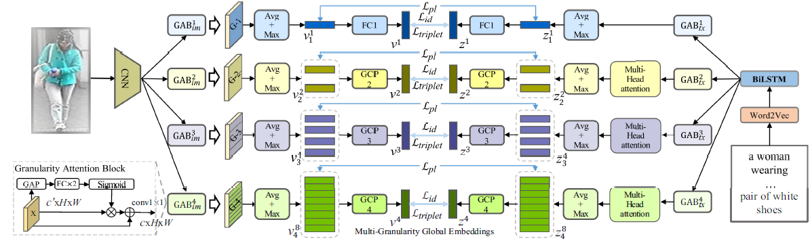

白杨：

提出模型MGEL，代码未开源

细粒度对齐的一篇工作，通过不同粒度的图像特征来引导不同粒度文本的特征学习，核心思想跟SSAN（详见本页总结15）有点相似。

图像不同粒度的表示可通过不同尺度的水平划分实现，文本这里有点意思了，和师兄的模型很像，都用多头注意力机制来提取局不同粒度特征，只是本文是在BiLSTM之上使用了一层多头自注意力，而师兄是使用BERT的多头注意力机制。

吐槽：本文也没有什么可说的，唯一有意思的地方在于mix特征的约束，采用了一大堆骚操作，说实话我觉得换一种约束都没问题，感觉是为了提出loss而提出loss，消融实验也没有关于mix特征约束的结果。除此之外，MGEL中使用的activation mapping function跟MSE比优势在哪？作者也没说。最后，作者贡献点里说自己提出了基于知识蒸馏的局部对齐约束，可是看完整篇文章都没找到只是蒸馏在哪。。。

总的来说，参考价值不是很大。

 

\35. 2019-arXiv-Visual-Textual Association with Hardest and Semi-Hard Negative Pairs Mining for Person Search

白杨：

person search任务中文本特点是抽象、局部，图像的特点是直观、全面，为了解决不同模态的差异性，本文创新性地引入了S-GMP放大图像与文本中的显著区域，同时提出了新的难负样本采样策略。

- S-GMP（Smoothed Global Maximum Pooling）：核心是通过sigmoid函数生成attention权重，权重与特征的位乘运算体现了放大显著区域。
- 难负样本采样策略：（唉，这个采样策略和前几天我想的采样策略完全一样，哭…… ）除了常规的跨模态难负样本之外，还提出了半难负样本（Semi-hard）用来增强模型的学习。详见论文图4.

2019年的工作，创新点也够，实验结果也还不错，没太想明白为什么还是挂arXiv。。。

王海光：

核心思想：

主要着眼于两个问题：

1. 作者认为，在person search中，文本的描述更加突出重点而不全面，图像的描述更加全面而没有重点，图像中有很多文本没有的信息，这是跨模题信息的一个gap。对于这个gap，作者认为可行的解决方式是将传统的图像特征和文本特征直接计算相似度的方式改成“查看文本特征中的信息是否包含于图像特征中”，实现方式是attention机制。
2. 此外，作者还着眼于跨模态学习损失中一个普遍的问题：模型为了降低负对的相似度，在提取信息的时候故意降低负对样本中相同信息的权重，但是这其实不对，一个负对可能局部是正对，比如都穿着灰色的汗衫。为了解决这个问题，作者提出了半难负样本概念。

可惜的是这篇文章好像是个半成品，后来作者不知道出于什么原因论文只放了个草稿到arXiv上就不管了。

代码：无

相关细节：

1. 作者的attention实现方式还挺奇特的，对于一个句子N个单词，LSTM将其编码为N*d的向量，然后取每个单词向量的最大值，得到N维向量，将这个向量归一化，得到权重，然后将这个权重乘上本来N*d的向量，得到文本特征。
2. 损失函数主要分为三部分：对于同模态的特征的损失函数和对于跨模态特征的损失函数，以及一个比较基础的正样本匹配损失。对于同模态特征，作者使用了triplet loss。据作者所说，这是为了增大模态内特征差异性，使得特征更加显著。对于模态特征，作者其实也用了triplet loss，但是说得比较玄乎——“最难负样本挖掘损失”，所谓“最难负样本”其实是一个在triplet loss中相对比较普遍的操作——跟其他样本计算余弦相似度，取id不同且最低的作为负样本。而作者的创新主要体现在“半难负样本”这个概念。具体来说，假设我们为图像V_i 选择了最难负样本T_j，那么我们就把V_j 和T_i 当做半难负样本，也加上triplet loss。

顺便吐个槽：

这篇文章好像效果不太好，rank-1才55.32%，18年ECCV发表的ViTAA都有55.97%（不过作者本人说是SOTA）。虽然也不是说只有SOTA才能发，但是可能效果不好也是作者没发出来的重要因素。另外，arXiv上的文章像是个半成品，具体理由如下：

1. 论文里底下这个模型图放大得有些过分，排版明显不合理。
2. 连性能对比的表格的标题都是错的（应该是CUHK-PEDES数据集上的性能对比，结果标题写成了COCO caption的性能对比）。
3. 公式还有很多打错的情况，而且符号命名也很混乱。
4. 消融实验有种在水字数的嫌疑，连dropout是只对正样本加还是对正负样本都加都写上去了。
5. 看模板像是打算投刊，可是不算参考文献才7页半，有种写到一半发现写不下去了（或者可能觉得自己性能比不过），于是乎弃疗的感觉。

为此，我查了下作者的论文集，好像其中一个作者后来用另一个方法做了这个课题，发了个水刊。

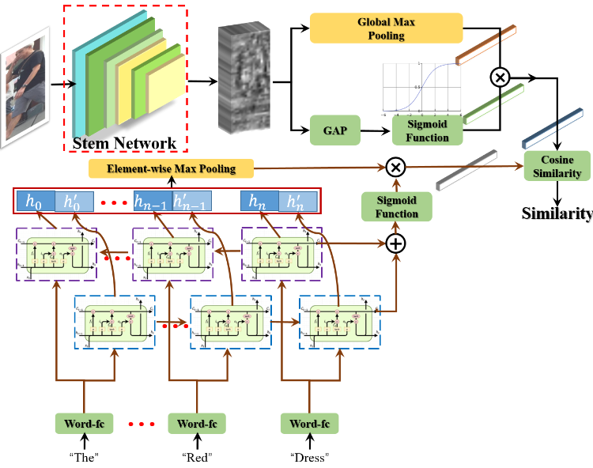

\36. 2022-arXiv-See Finer, See More: Implicit Modality Alignment for Text-based Person Retrieval

王海光：

核心思想：

看模板似乎是投ECCV，大概率是2021ECCV被拒（不知道直接用ECCV的模板挂上arXiv是不是因为作者弃疗了）。方法上一个很新颖的点是文本和图像共享一个编码器（当然，肯定不是输入文本和输入图像阶段就开始共享，而是先分别映射为word embedding和patch embedding，然后输入同一个编码器）。比较可惜的是，这篇论文堆叠了太多其他person search经典论文的方法，包括多粒度（word/phrase/sentence）、模态掩码、CMPM loss，导致整篇论文作者的创新显得太单薄。

代码：无

相关细节：

1. 作者在文本和图像进入共享的编码器前，首先将二者分别取word embedding和用卷积得到patch embedding，并且分别加上不同的可学习的positional embedding和type embedding(type embedding作者介绍的比较含糊，私以为大概率是用于区分输入特征类型是图像还是文本)
2. 这篇文章的掩码比较神奇，lapscore的掩码是需要利用另一个模态的信息来预测的，这篇论文如果我没理解错，掩码后并不预测掩码原来是什么，而是将掩码后的图像和文本进行匹配，相当于做了一个消除部分信息数据增强，消除一部分信息，来诱导模型利用好其他信息做匹配。特别地，这篇论文的图像掩码是MAE那种直接擦掉像素式的，和lapscore那种掩码掉颜色的有区别；按照作者的说法，mask文本的单词和图像的像素都是随机的，私以为这种方式还是存在局限的，有可能mask掉的其实并不是信息量很高的局部。
3. 作者虽然名义上提出了三个模块，但是实际上三个模块就是三种不同形式的文本-图像匹配（以文本来说，分为全局文本特征、短语特征、单词特征、掩码后的文本特征），所以损失函数出奇地一致，都是CMPM。

启发：

1. 这篇论文共享编码器我觉得其实挺精妙的，但是按照我不怎么样的水平，我觉得如果能取消区分输入是图像还是文本的type embedding，然后在编码器后加上一个用于区分特征是编码自图像还是文本的对抗网络（并且最终效果还行的话），这个工作将绝杀，可惜换不得。

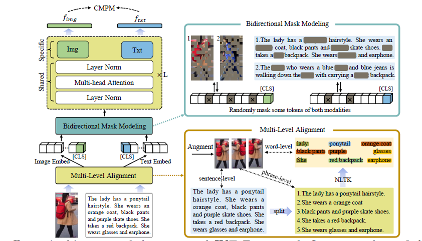

 

\37. 2022-arXiv-CAIBC: Capturing All-round Information Beyond Color for Text-based Person Retrieval

王海光：

核心思想：

看模板似乎是投ACMMM，不确定中没中（PS：有个作者英文名叫Yifeng Li）。这篇论文跟我的理念还挺像的，不能让模型单纯依赖颜色（其实看标题就可以看出这层意思），要让模型捕捉到更全面，更多变的信息。但是坦白说，他的模型所谓的“不依赖颜色”其实就是拿灰度图和无颜色词文本匹配，这样就没有颜色信息了。虽然这好像逻辑上也没问题，但总感觉解决方案有点极端，过犹不及。（PS：这个模型图给我一种强烈的deja vu，感觉很像是我们审过的一篇文章）

代码：无

相关细节：

1. 这个作者的text backbone略显神奇，一开始先将输入文本用bert编码，随后用bi-GRU再编码一次。（这种两层backbone堆叠在2021-BMVC-Text-Based Person Search with Limited Data这篇论文中也有使用）
2. 一个比较特别的点是作者的模型听上去似乎是两个branch——有色和灰度。但是实际上是三个branch，第三个branch的实现方式也很简单，就是文本/图像的有色特征减去它们的无色特征，也就是抹去了纹理等信息的纯粹的颜色branch（和有色branch相比，有色branch还包含纹理这些，而颜色branch则不含这些）。这三个分支都进行图像-文本匹配并计算三元损失。
3. 作者还提出了一个ML损失，这个损失的作用是衡量上述三个branch得到特征进行ID分类（即CMPM loss，将每个特征分类到训练集的ID数上，每个ID对应一个概率）的交叉熵。具体来说，以图像灰度图branch得到的特征为例，其分别与有色branch特征和颜色branch特征先都进行一次线性映射进行ID分类，随后灰度branch的分类概率与有色branch特征和颜色branch得到的分类概率分别计算交叉熵并求和，并约束其尽可能小。

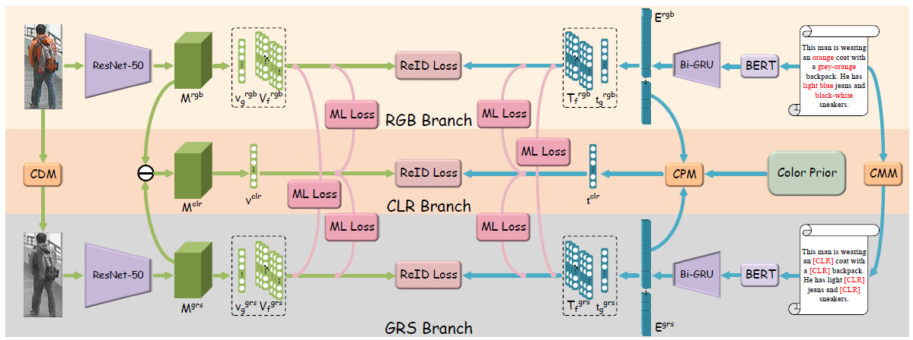

\38. 2022-arXiv-Learning Granularity-Unified Representations for Text-to-Image Person Re-identification

王海光：

核心思想：看模板是一篇投ACMMM的工作。作者提到了图像包含的信息比文本更加丰富的特点，于是提出如果能够做到适当减少图像的信息或是适当增加文本信息，来减小图像模态和文本模态之间的信息gap，或许匹配效果会变得更好。

代码：[GitHub - ZhiyinShao-H/LGUR](https://github.com/ZhiyinShao-H/LGUR) 

相关细节：

1. 和之前的一些工作一样，这篇论文也采用了堆叠backbone的做法（这是某种新的潮流吗？），堆叠的是ResNet+DeiT以及BERT和Bi-LSTM。
2. 为了实现在核心思想里提到的“当减少图像的信息或是适当增加文本信息”，作者采用了一个特殊的MSD模块，这也是作者的核心创新点。首先生成k*d维的特征字典矩阵（大家可以理解为这里有k个特征，每个对应图像/文本中的一部分信息敏感或者说对应某种特定类型的信息），然后用这个字典向量作为transformer中的K和V，文本特征向量作为transformer中的Q，然后进行一次正常的前向传播。对于图像过程类似（作者的这个方法让我产生一些疑问，作者的transformer到底有没有加残差模块？如果加了，那不论transformer做了何种操作，这个所谓信息减少变化其实都很难说明有效），不过图像稍微加了一些限制以实现“减少图像信息”，具体来说，首先对图像特征进行1*1卷积，得到一个H*W*1的mask，这个mask用于区分图像每个局部特征是前景还是背景；另一方面，图像除了和D传入transformer一次外，还和文本特征传入一次transformer，得到根据文本特征精炼的图像特征，并且用三元损失约束这个根据文本特征精炼的图像特征和D精炼的图像特征的相似度（这个损失函数略显复杂，所以这里不展开介绍，感兴趣的同学可以去看原文）。
3. 作者还提了个PGU模块，作用在于将文本和图像映射到一个公共空间。但是说实话，这里的公式部分实在是看得有点难受，如果我没理解错的话，其实作者这里提的模块完全可以一个式子表示整个矩阵的操作，但是作者非要拆成对矩阵每一行操作并合并，我不知道这是因为作者觉得这样表示更方便还是因为作者没注意到，但是我个人看的话确实公式没有直接按照整个矩阵写方便。而且按照我的理解，这个模块其实就是文本和图像特征共享一个transformer和对应的K, V输入，然后分别输入transformer输出特征。如此简单的一件事，这个作者搞了一堆奇奇怪怪的表述，搞得我直接被绕进去，不知所云了。

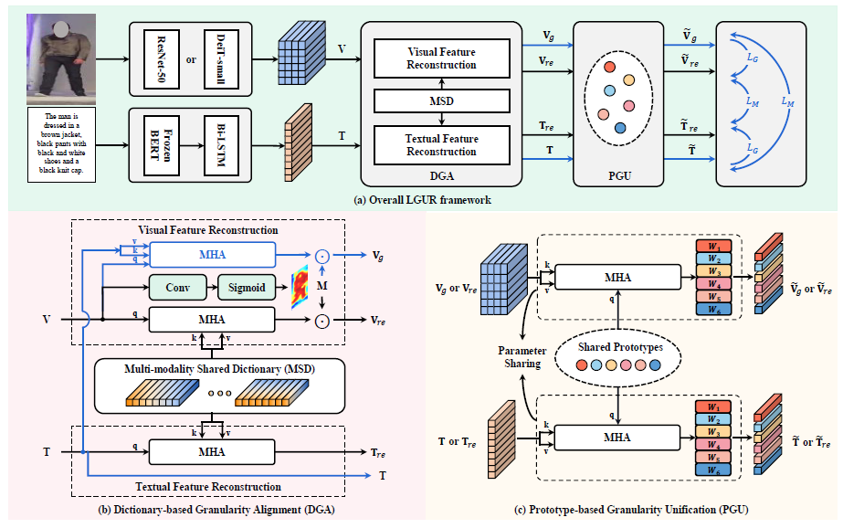

 
