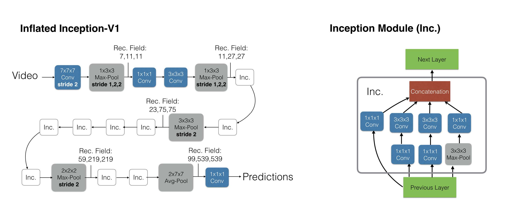

| 序号 | 论文标题                                                     | 更新时间   |
| ---- | ------------------------------------------------------------ | ---------- |
| 1    | 2021-ICCV-ViViT: A Video Vision Transformer                  | 2022.10.04 |
| 2    | 2017-CVPR-Quo Vadis, Action Recognition? A New Model and the Kinetics Dataset | 2022.11.30 |
|      |                                                              |            |

template：

**20xx-where-title**

核心思想：

xxxx

代码：xxxx

相关细节：

顺便吐个槽：

启发：

0. 数据集介绍：
    1. *Kinetics*：分为Kinetics400和Kinetics600，400和600分别表示类别数，前者大概有267,000段视频，后者大概有446,000段视频。视频均为25fps的10秒视频。需要注意的是这个数据集的视频都是存在YouTube上的，所以和flickr一样，会随着时间而资源慢慢失效。
    2. *Epic Kitchens-100*：在厨房中拍摄的第一人称视角视频，包含共计100小时的90,000个clip。该数据集的数据表示都是一个动词+一个名词。
    3. *Moments in Time*：包含800,000段3秒的YouTube clip。
    4. *Something-Something v2*：包含220,000段视频，每段持续时间为2-6秒。有别于其他数据集的是本数据集一般物体和背景保持不变，行动发生变化，所以更注重模型的动作细节甄别能力。

\1. **2021-ICCV-ViViT: A Video Vision Transformer**

核心思想：

xxxx

代码：[Google-research/scenic](https://github.com/google-research/scenic)

相关细节：

1. ViT曾经提到了将transformer用于图像时需要采用大数据集训练才有明显的增益。ViT的作者将此解释为transformer对于卷积缺少一些归纳不变形（所谓归纳不变形，可以参考机器翻译的过程），因而需要更多的数据进行训练或者更强的正则化。

1. 本文使用的MLP包含两层，通过GELU连接。（GELU这个激活函数相比于RELU还是有一定的理论优越性的，以后在transformer相关的结构列可以试试）

1. 作者对video的patch embedding提出了两种方案：uniform frame sampling和tubelet embedding的概念。前者是把视频视作若干张图像（不一定每一帧都取），每张图像按照ViT的方式划分patch；后者其实就是把ViT中的patch增加了一个时间维度。不过加其实也有很多种方式，作者在实验部分对不同的时间维度添加方法进行了比较。

1. 作者提出，视频的transformer可以有多种结构，具体来说如下：

   1. *token全排列*：和ViT一样将视频的所有token embedding和cls embedding一起输入模型。这种模式在transformer的时间复杂度为$O(n^2)$，对于视频来说，处理速度很难接受。

   1. *层级transformer*：具体来说就是两个transformer各司其职，第一个transformer先将所有视频帧按照图像编码，随后得到的所有帧的全局特征输入或所有局部特征的平均池化第二个transformer（两个transformer都是有positional/temporal embedding的）

      

   1. *层级attention*：结构和模型1大体上类似，但是每次attention操作不是所有token之间做，而是分为两级：空间的attention和时间的attention。复杂度和模型2一致。

      

   1. *层级点积注意力*：和思路2,3类似，不过这次是在attention的计算公式上入手，同一个特征有两种映射方式，分别是$K_s,V_s\in\mathbb{R}^{n_h\cdot n_w\times d}$和$K_t, V_t\in \mathbb{R}^{n_t\times d}$，对于一半的头，采用前一种计算方式，即$Y_s=Attention(Q, K_s, V_s)$，对于剩下的头，则采取后一种计算方式$Y_t=Attention(Q, K_t, V_t)$。最终将两种输出拼接起来，即$Y=Concat(Y_s, Y_t)\cdot W_o$。

   1. 从实验结果上来看，前两种模型效果整体较好，后两种模型则相对较差。但是参数量则是1、4模型较少，2、3相对较多，而处理宿舍则是1>3>2>4。

1. 作者想要像ViT一样利用大量数据训练自己的模型，但是视频数据集目前还达不到那么大的规模，于是作者想要利用ViT的参数来初始化自己的模型。每个模型的初始化策略有所区别：

   1. positional embedding：考虑到视频模型除了空间关系外还有时序关系，不同帧的positional embedding未必需要相同，作者将每个帧的positional embedding先都加载为ViT的参数，后续各自训练。
   1. 三维卷积embedding权重：tubelet embedding需要对三维而不是二维的像素进行embedding，一个比较直观的解决方法是将patch内所有帧二维映射后求平均。作者还提供了一种替代思路："central frame initialisation"，即初始化只取一个卷积核$\frac{t}{2}$的帧的二维embedding，剩下的全部置零，用公式表示即为$E=[0,...,E_{central},...,0]$，初始时和上文的"Uniform frame sampling"类似，在训练过程中让模型自己调整$E$。（有个问题，既然你其他地方都置零了，那神经元后面训练不就无法激活了？何谈调整？）（不过从实验结果上来看，这种方式还是最好的，在Kinetics上达到了79.2的Rank-1准确率）

1. 预测时模型输入是采样步长为2的32帧的clip，对于长视频，还会处理其不同的view（我的理解是取不同的clip）并将结果取均值作为最终结果。

1. 作者使用了几种正则化方式，分别是：Kinetics 400初始化、随机深度（这个是啥？引用的论文Deep networks with stochastic depth）、随机数据增强、标签平滑（Rethinking the inception architecture for computer vision）、Mixup（Mixup: Beyond empirical risk minimization）。

1. 作者还消融了tubelet的尺寸对准确率和运行速度的影响，在空间尺寸固定为$16\times 16$的情况下，时间尺寸从2提升到8，准确率和运行速度都在下降。这说明更小的tubelet效果更好。

1. 如果增加输入模型的视频帧数，整体效果都会上升。但是增加在视频中采集的clip数，效果则会先增后降。而提升分辨率则会给准确率带来细微的提升，同时大幅降低处理速度。

\2.   **2017-CVPR-Quo Vadis, Action Recognition? A New Model and the Kinetics Dataset**

核心思想：

提出kinetics数据集、action recognition任务和I3D模型的论文。模型基于双流膨胀3D卷积架构。

相关细节：

1. 作者对比了视频领域的3种不同方法：
    	1. CNN+LSTM是常用方法，但是一般只能获得比较高级的特征，对于一些比较低级的视觉特征则无法获取。
        2. 传统的3D卷积参数量更大，且难以使用ImageNet预训练的结果，故而之前的3D卷积效果也并不很理想。
        3. 双流CNN：对于某一帧进行两种编码，一种是用CNN对RGB图像进行编码，另一种是用10帧光流。该框架不光性能出众，训练速度也很快。
2. 作者的3D卷积核使用2D卷积核初始化，并且在时序维度上进行复制。但是复制完后为了保证正则化还对权重除以了$N$（即时序数）
3. 作者重点调研了时序上的采样和pooling步长。前两次pooling不对时序进行pooling。
4. 作者的3D卷积是双流的，一个RGB和一个光流，但是二者是分开训练的，测试时将二者的结果取均值。

