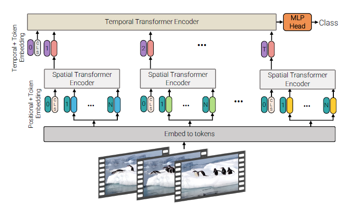
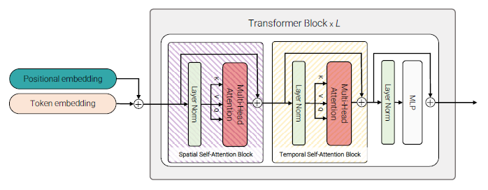
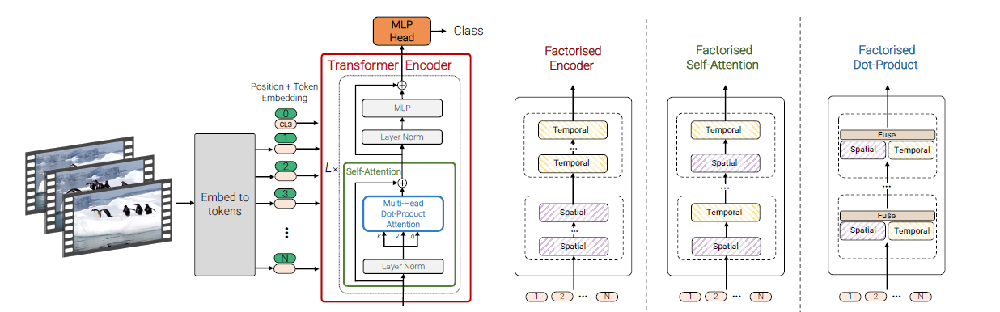

| 序号 | 论文标题                                    | 更新时间   |
| ---- | ------------------------------------------- | ---------- |
| 1    | 2021-ICCV-ViViT: A Video Vision Transformer | 2022.10.04 |

template：

**20xx-where-title**

核心思想：

xxxx

代码：xxxx

相关细节：

顺便吐个槽：

启发：

0. 数据集介绍：
   1. *Kinetics*：分为Kinetics400和Kinetics600，400和600分别表示类别数，前者大概有267,000段视频，后者大概有446,000段视频。视频均为25fps的10秒视频。需要注意的是这个数据集的视频都是存在YouTube上的，所以和flickr一样，会随着时间而资源慢慢失效。
   2. *Epic Kitchens-100*：在厨房中拍摄的第一人称视角视频，包含共计100小时的90,000个clip。该数据集的数据表示都是一个动词+一个名词。
   3. *Moments in Time*：包含800,000段3秒的YouTube clip。
   4. *Something-Something v2*：包含220,000段视频，每段持续时间为2-6秒。有别于其他数据集的是本数据集一般物体和背景保持不变，行动发生变化，所以更注重模型的动作细节甄别能力。

1. **2021-ICCV-ViViT: A Video Vision Transformer**

   核心思想：

   xxxx

   代码：[Google-research/scenic](https://github.com/google-research/scenic)

   相关细节：

   1. ViT曾经提到了将transformer用于图像时需要采用大数据集训练才有明显的增益。ViT的作者将此解释为transformer对于卷积缺少一些归纳不变形（所谓归纳不变形，可以参考机器翻译的过程），因而需要更多的数据进行训练或者更强的正则化。
   
   1. 本文使用的MLP包含两层，通过GELU连接。（GELU这个激活函数相比于RELU还是有一定的理论优越性的，以后在transformer相关的结构列可以试试）
   
   1. 作者对video的patch embedding提出了两种方案：uniform frame sampling和tubelet embedding的概念。前者是把视频视作若干张图像（不一定每一帧都取），每张图像按照ViT的方式划分patch；后者其实就是把ViT中的patch增加了一个时间维度。不过加其实也有很多种方式，作者在实验部分对不同的时间维度添加方法进行了比较。
   
   1. 作者提出，视频的transformer可以有多种结构，具体来说如下：
   
      1. *token全排列*：和ViT一样将视频的所有token embedding和cls embedding一起输入模型。这种模式在transformer的时间复杂度为$O(n^2)$，对于视频来说，处理速度很难接受。
   
      1. *层级transformer*：具体来说就是两个transformer各司其职，第一个transformer先将所有视频帧按照图像编码，随后得到的所有帧的全局特征输入或所有局部特征的平均池化第二个transformer（两个transformer都是有positional/temporal embedding的）
   
         
   
      1. *层级attention*：结构和模型1大体上类似，但是每次attention操作不是所有token之间做，而是分为两级：空间的attention和时间的attention。复杂度和模型2一致。
   
         
   
      1. *层级点积注意力*：和思路2,3类似，不过这次是在attention的计算公式上入手，同一个特征有两种映射方式，分别是$K_s,V_s\in\mathbb{R}^{n_h\cdot n_w\times d}$和$K_t, V_t\in \mathbb{R}^{n_t\times d}$，对于一半的头，采用前一种计算方式，即$Y_s=Attention(Q, K_s, V_s)$，对于剩下的头，则采取后一种计算方式$Y_t=Attention(Q, K_t, V_t)$。最终将两种输出拼接起来，即$Y=Concat(Y_s, Y_t)\cdot W_o$。
   
   1. 作者想要像ViT一样利用大量数据训练自己的模型，但是视频数据集目前还达不到那么大的规模，于是作者想要利用ViT的参数来初始化自己的模型。每个模型的初始化策略有所区别：
   
      1. positional embedding：考虑到视频模型除了空间关系外还有时序关系，不同帧的positional embedding未必需要相同，作者将每个帧的positional embedding先都加载为ViT的参数，后续各自训练。
      1. 三维卷积embedding权重：tubelet embedding需要对三维而不是二维的像素进行embedding，一个比较直观的解决方法是将patch内所有帧二维映射后求平均。作者还提供了一种替代思路："central frame initialisation"，即初始化只取一个卷积核$\frac{t}{2}$的帧的二维embedding，剩下的全部置零，用公式表示即为$E=[0,...,E_{central},...,0]$，初始时和上文的"Uniform frame sampling"类似，在训练过程中让模型自己调整$E$。（有个问题，既然你其他地方都置零了，那神经元后面训练不就无法激活了？何谈调整？）
   
   
   顺便吐个槽：
   
   启发：
   
   