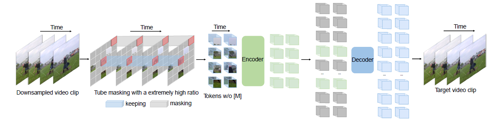
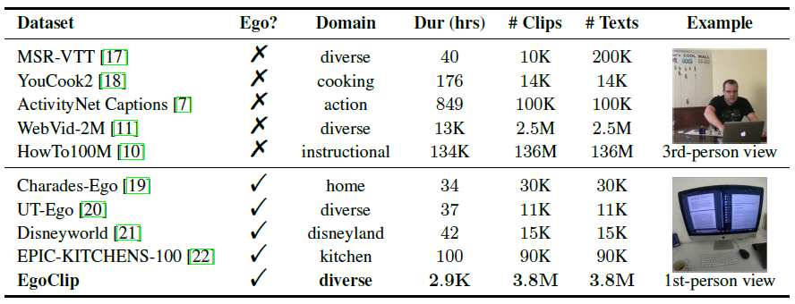

| 序号 | 论文标题                                                     | 更新时间   |
| ---- | ------------------------------------------------------------ | ---------- |
| 1    | 2023-NeurIPS-VideoMAE: Masked Autoencoders are Data-Efficient Learners for Self-Supervised Video Pre-Training | 2022.09.30 |
| 2    | 2023-NeurIPS-Egocentric Video-Language Pretraining           | 2022.10.14 |
|      |                                                              |            |

template：

**20xx-where-title**

核心思想：

xxxx

代码：xxxx

相关细节：

顺便吐个槽：

启发：

1. **2023-NeurIPS-VideoMAE: Masked Autoencoders are Data-Efficient Learners for Self-Supervised Video Pre-Training**

   核心思想：

   将MAE的思想迁移到视频中。除了达到SOTA外还有三个新发现：(1) 即便mask掉90%-95%的视频，依然不影响VideoMAE的重建性能。(2) VideoMAE在极小数据集上可以实现很高的性能。(3) 预训练数据的质量比数量更重要。由于视频本身存在一定的时序关系，单纯mask掉几个像素很容易造成信息泄漏，因而本文提出一种tube mask策略。

   代码：[VideoMAE](https://github.com/MCG-NJU/VideoMAE)

   相关细节：

   1. 降采样：视频输入模型后先进行降采样，从中选取包含t个连续帧的一个clip，随后通过时序采样将clip进一步压缩为T帧。本文的时序采样stride随数据集不同而不同，在Kinetics上位4，在Something-Something上则为2。
   2. token embedding：使用大小为$2\times 16\times 16$的cube来进行embedding。
   3. tube masking：根据作者的实验，VideoMAE相比于ImageMAE需要更高的掩码比例，因为视频的信息密度更低。为了防止不同帧之间的信息泄漏问题，同一个视频的不同帧mask的tube都是一样的。
   4. backbone采用ViT和space-time attention的结合。虽然space-time模块的复杂度是平方级的，但是由于输入时大部分的cube token都被mask了，所以该问题得到了一定程度上的改善。
   5. 实验表明，增加mask的比例，确实对模型的性能有所提升。（有一种猜想，可以通过mask语义信息更加明确的像素，或许对模型的性能有帮助）
   6. 模型在数据集之间迁移的性能很高，证明了模型的通用性。
   7. 作者注意到，UCF101 and HMDB51在自己的训练集上训练后在自己的测试集上测试的结果并不如在Something-Something V2预训练并在自己的测试集上测试的结果。作者猜测这有可能是Something-Something V2数据量更大导致的。然而即便削减了Something-Something V2的数据量并进行预训练，性能仍然高于UCF101 and HMDB51在自己的训练集上训练的结果，这验证了预训练数据的质量比数量更重要。
   
   
   
   
   
2. **2023-NeurIPS-Egocentric Video-Language Pretraining**
   
      核心思想：
   
      作者进行了Ego4d上的文本-视频跨模态预训练（PS：这里提到了一个用于第三人称视角视频的预训练数据集HowTo100M）。作者主要进行了三个方面的工作：(1) 从Ego4d原数据集中挖掘出了3.8Mclip-文本对作为第一视角跨模态文本-视频预训练数据集。(2) 提出了一个训练损失函数：EgoNCE，利用视频-文本对比学习来训练模型。(3) 提出了和EgoClip相近的新指标EgoMCQ。除了Ego4d数据集本身外，作者在三个数据集的五个下游任务验证了所提出模型的性能：EPIC-KITCHENS-100上的video-text retrieval，Charades-Ego上的动作识别，Ego4D的自然语言定位、时刻定位、物体状态变化分类。
   
      代码：[EgoVLP](https://github.com/showlab/EgoVLP)
   
      相关细节：
   
      1. 现有视频-文本预训练数据集大致可以分为两类：第三人称视角视频数据集、第一人称视角视频数据集。这两类的主要数据集及其相关信息如表所示：
      
         
      
      2. 作者提到HowTo100M里的文本标注是通过语音识别得到的，这导致整个数据集大部分的标注都存在缺陷。
      3. 鉴于Ego4d的文本采用的是时间戳标注，所以本文在构建数据集时提出了上下文变长clip匹配策略，具体来说，对于有n个时间戳$\{t_0, ...,t_{n-1}\}$且每个时间戳都有一个sentence表述$\mathcal{T}_i$。而对于$\mathcal{T}_i$，作者选取其对应clip的策略为$[t_i^{start},t_i^{end}]=[t_i-\beta_i/2\alpha, t_i+\beta_i/2\alpha]$。其中$\beta_i$是一个对每个视频不同的适应性参数，作者取了视频的时间戳平均距离，即$\frac{t_{n-1}-t_0}{n-1}$，而$\alpha$则是一个scale因子，作者选取了所有视频的$\beta_i$的均值(4.9秒)。作者使用消融实验证明了这两种设计是最好的。（**PS：在消融实验中，作者尝试了几种不同的预训练clip选择策略，从结果上来看，如果测试任务选取低难度任务，则几种方案差别不明显，而如果选取高难度任务，例如接下来提到的inter-video MCQ，作者的clip选择策略就有显著优势了**）
      4. 作者在预训练的模型结构上并无太大的创新，而是使用了一个经典的双编码器架构，即video编码器+text编码器，本文采用的是TimeSformer+DistillBERT。两个编码器可以被替换。
      5. 尽管InfoNCE作为一个预训练常用损失函数取得了巨大的成功，但是在视频-文本预训练领域，InfoNCE面临着巨大的模态标注不一致问题，所以前人工作提出MIL-NCE，将时序上最接近的caption作为正样本。而第一人称视角视频面临着两个新问题：(a) 同一个动作可以在不同场景出现（例如打电话可以在床上或马路上出现）(b) 同一场景下的不同动作可能会有难以区分的视频特征，例如在笔记本上打字和移动鼠标。为了处理这两个问题，作者的解决措施分别如下：
         1. 针对问题一：作者对于每个标注提取动词和名词并构建词典、合并同义词，对于两个标注，如果至少一个动词/名词是同义词，便认为是正样本对。
         2. 针对问题二：作者将同一场景内的不同动作视为难负样本。于是对于一个batch $\mathcal{B}=\{1,2,...,N\}$，对其中给每个clip $i$都采样一个其在原视频中的临近clip $i'$作为负样本。于是整个batch可以被扩展为$\{1,2,...,N,1',2',...,N'\}$。不过特别地，训练时同一个batch内其他样本$j$引入的负样本$j'$也会被引入训练，$j'$本身是否是$i$的正样本似乎作者并不判断，纯粹按负样本来，而且加入训练似乎也意义不明。这点可以改进。
      
      6. 为了证明自己的模型在video-text方面的特长，作者特地提出了一个全新的benchmark——EgoMCQ。该benchmark包含的数据来自于未被选入Egoclip的Ego4d数据（主要来自于Ego4d的验证集），并且剔除了其中和预训练集有交叉view的clip。任务的形式则是Multiple-Choice Questions (MCQ)，该任务给出一段文本描述并要求模型在给出的5个视频clip中选择出和文本对应的那一个，具体来说分为两种：inter-video：5个clip都来自不同的视频；intra-clip：5个clip来自同一个视频（后者更接近text-based video grounding）。
      
      7. 作者模型利用Egoclip预训练的性能相比于利用其他数据集预训练还是高出很多的。但是instance-retrieval任务上的性能和高帧率、输入多元化（包含RGB、光流和音频）的TBN特征在不预训练的情况下效果相差也不是很大，在其他任务上和slow-fast backbone模型取得的性能也相差无几。
      
      8. 作者在附录里介绍了很多构建数据集的细节，不过考虑到我目前还不需要考虑构建数据集这种问题，所以暂时搁置，后续有需求的话会再回来补充。
      
      启发：
      
      1. 作者本人提到，本模型还未利用好Ego4D的长期时序依赖信息，后续会作为一个改进方向。
      
      